# *Prova 1 de GED13*
## Questão 1
### Inicialização

```r
  library(tidyverse);
  library(ggplot2)
  library(quantmod) # Para usar o "getSymbols"
  library(data.table) # Para usar o "shift"
  library(ggpubr) # Para usar o "ggarrange" e "annotate_figure"
  library(cowplot) # Para fazer "qqplot" junto com histograma
  library(gridExtra) # Para inserir tabela no "qqplot"
  start <- as.Date("2022-01-01")
  end <- as.Date("2022-09-01")
```
### Dados do SP 500

```r
  dados.sp500 <- quantmod::getSymbols("^GSPC", src = "yahoo", from = start, to = end, auto.assign = FALSE)
  nasdaq <- na.omit(dados.sp500)
```

#### Cria o vetor de preco de fechamento

```r
  preco_fechamento <- dados.sp500$"GSPC.Close"
```

#### 1. Media do Preco de Fechamento

```r
  media_pf <- mean(preco_fechamento)
  media_pf
```

```
## [1] 4222.706
```

#### 2. Moda do Preco de Fechamento 

```r
  tab_preco_fechamento <- table(preco_fechamento)
  moda_pf <- names(tab_preco_fechamento)[which(tab_preco_fechamento==max(tab_preco_fechamento))]
  moda_pf
```

```
##   [1] "3666.77002"  "3674.840088" "3735.47998"  "3749.629883" "3759.889893" "3764.790039"
##   [7] "3785.379883" "3789.98999"  "3790.379883" "3795.72998"  "3801.780029" "3818.800049"
##  [13] "3818.830078" "3821.550049" "3825.330078" "3830.850098" "3831.389893" "3845.080078"
##  [19] "3854.429932" "3863.159912" "3899.379883" "3900.110107" "3900.790039" "3900.860107"
##  [25] "3901.360107" "3902.620117" "3911.73999"  "3921.050049" "3923.679932" "3930.080078"
##  [31] "3935.179932" "3936.689941" "3941.47998"  "3955"        "3959.899902" "3961.629883"
##  [37] "3966.840088" "3973.75"     "3978.72998"  "3986.159912" "3991.23999"  "3998.949951"
##  [43] "4001.050049" "4008.01001"  "4017.820068" "4023.610107" "4023.889893" "4030.610107"
##  [49] "4057.659912" "4057.840088" "4072.429932" "4088.850098" "4091.189941" "4101.22998" 
##  [55] "4108.540039" "4115.77002"  "4118.629883" "4121.430176" "4122.470215" "4123.339844"
##  [61] "4128.72998"  "4130.290039" "4131.930176" "4132.149902" "4137.990234" "4140.060059"
##  [67] "4140.77002"  "4145.189941" "4146.870117" "4151.939941" "4155.169922" "4155.379883"
##  [73] "4158.240234" "4160.680176" "4170.700195" "4173.109863" "4175.200195" "4175.47998" 
##  [79] "4176.819824" "4183.959961" "4199.120117" "4201.089844" "4204.310059" "4207.27002" 
##  [85] "4210.240234" "4225.5"      "4228.47998"  "4259.52002"  "4262.450195" "4271.779785"
##  [91] "4274.040039" "4277.879883" "4280.149902" "4283.740234" "4287.5"      "4288.700195"
##  [97] "4296.120117" "4297.140137" "4300.169922" "4304.759766" "4305.200195" "4306.259766"
## [103] "4326.509766" "4328.870117" "4348.870117" "4349.930176" "4356.450195" "4357.859863"
## [109] "4363.490234" "4373.939941" "4380.259766" "4384.649902" "4386.540039" "4391.689941"
## [115] "4392.589844" "4393.660156" "4397.450195" "4397.939941" "4401.669922" "4410.129883"
## [121] "4411.669922" "4412.529785" "4418.640137" "4431.850098" "4446.589844" "4456.240234"
## [127] "4459.450195" "4461.180176" "4462.209961" "4463.120117" "4471.069824" "4475.009766"
## [133] "4477.439941" "4481.149902" "4482.72998"  "4483.870117" "4488.279785" "4500.209961"
## [139] "4500.529785" "4504.080078" "4511.609863" "4515.549805" "4520.160156" "4521.540039"
## [145] "4525.120117" "4530.410156" "4532.759766" "4543.060059" "4545.859863" "4546.540039"
## [151] "4575.52002"  "4577.109863" "4582.640137" "4587.180176" "4589.379883" "4602.450195"
## [157] "4631.600098" "4659.029785" "4662.850098" "4670.290039" "4677.029785" "4696.049805"
## [163] "4700.580078" "4713.069824" "4726.350098" "4793.540039" "4796.560059"
```

#### 3. Mediana do Preco de Fechamento 

```r
  mediana_pf <- median(preco_fechamento)
  mediana_pf
```

```
## [1] 4207.27
```

#### 4. Variancia Nao Viesada 

```r
  variancia_pf <- var(preco_fechamento)
  variancia_pf
```

```
##            GSPC.Close
## GSPC.Close   72749.01
```

#### 5. Desvio-padrao 

```r
  desv_pad_pf <- sd(preco_fechamento)
  desv_pad_pf
```

```
## [1] 269.7202
```

#### 6. Grafico de linha do Preco de Fechamento 

```r
  ggplot(dados.sp500, aes(x = index(dados.sp500), y = preco_fechamento)) + geom_line() +
        labs(title="Grafico do SP 500", subtitle="Preco de Fechamento", caption="Fonte: https://finance.yahoo.com/", x = "Data ", y="Preco (R$)") +
        theme(plot.title = element_text(hjust = 0.5), plot.subtitle = element_text(hjust = 0.5)) +
        scale_x_date(date_labels = "%b %y", date_breaks = "1 month")
```

```
## Don't know how to automatically pick scale for object of type xts/zoo. Defaulting to continuous.
```

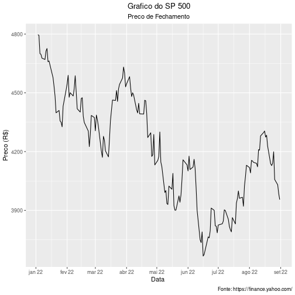

#### 7. Retorno, com base no Preco de Fechamento 

```r
  retorno_pf <- (preco_fechamento - shift(preco_fechamento, 1L, type="lag"))/shift(preco_fechamento, 1L, type="lag")
  retorno_pf <- na.omit(retorno_pf)
  tabela_preco_retorno <- cbind(preco_fechamento, retorno_pf)
  head(tabela_preco_retorno)
```

```
##            GSPC.Close  GSPC.Close.1
## 2022-01-03    4796.56            NA
## 2022-01-04    4793.54 -0.0006296221
## 2022-01-05    4700.58 -0.0193927578
## 2022-01-06    4696.05 -0.0009637689
## 2022-01-07    4677.03 -0.0040502168
## 2022-01-10    4670.29 -0.0014410312
```

#### 8. Grafico de linha do Retorno 

```r
  ggplot(retorno_pf, aes(x = index(retorno_pf), y = 100*retorno_pf)) + geom_line() +
        labs(title="Grafico do SP 500", subtitle="Retorno", caption="Fonte: https://finance.yahoo.com/", x = "Data ", y="Retorno (%)") +
        theme(plot.title = element_text(hjust = 0.5), plot.subtitle = element_text(hjust = 0.5)) +
        scale_x_date(date_labels = "%b %y", date_breaks = "1 month")
```

```
## Don't know how to automatically pick scale for object of type xts/zoo. Defaulting to continuous.
```

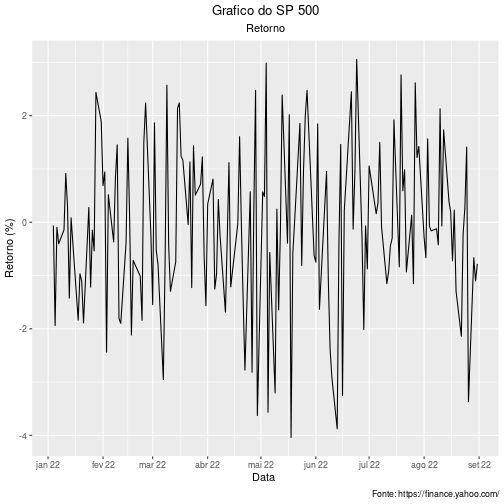

#### 9. Box plot para dados originais (Preco de Fechamento e Retorno) e padronizados 

```r
  boxplot_pf <- ggplot(data = preco_fechamento, aes(x = "", y = preco_fechamento))+
                      geom_violin(trim = FALSE, color="blue") +
                      geom_boxplot(width=0.4, color="blue", alpha = 1, outlier.size = 1) +
                      labs(x = "Preco", y = "") +
                      scale_y_continuous(breaks = seq(16, 23, by = 1))

  z_preco_fechamento <- (preco_fechamento - mean(preco_fechamento)) / sd(preco_fechamento)

  boxplot_z_pf <- ggplot(data = z_preco_fechamento, aes(x = "", y = z_preco_fechamento)) +
                        geom_violin(trim = FALSE, color="goldenrod3") +
                        geom_boxplot(width=0.4, color="red", alpha = 1, outlier.size = 1)+
                        labs(x = "Preco Padronizado", y = "") +
                        scale_y_continuous(breaks = seq(-5, 23, by = 1))

  boxplots_pf <- ggarrange(boxplot_pf, boxplot_z_pf,ncol = 2, nrow = 1)
  annotate_figure(boxplots_pf, top = text_grob("Boxplot/Vioplot do Preco de Fechamento\ne Preco de Fechamento Padronizado", color = "Black", face = "bold", size = 14),
                  bottom = text_grob("Fonte: https://finance.yahoo.com/", color = "black", hjust = 1.02, x = 1,size = 10))
```

 e padronizados-1.png)

```r
  boxplot_retorno <- ggplot(data = retorno_pf, aes(x = "", y = 100*retorno_pf)) +
                            geom_violin(trim = FALSE, color="blue") +
                            geom_boxplot(width=0.4, color="blue", alpha = 1, outlier.size = 1) +
                            labs(x = "Retorno (%)", y = "") +
                            scale_y_continuous(breaks = seq(-7, 6, by = 2))

  z_retorno_pf <- (retorno_pf - mean(retorno_pf))/(sd(retorno_pf))

  boxplot_z_retorno_pf <- ggplot(data = z_retorno_pf, aes(x = "", y = z_retorno_pf)) +
                            geom_violin(trim = FALSE, color="red") +
                            geom_boxplot(width=0.4, color="red", alpha = 1, outlier.size = 1) +
                            labs(x = "Retorno Padronizado", y = "") +
                            scale_y_continuous(breaks = seq(-3, 11, by = 2))

  boxplots_retorno <- ggarrange(boxplot_retorno, boxplot_z_retorno_pf,ncol = 2, nrow = 1)
  annotate_figure(boxplots_retorno, top = text_grob("Boxplot/Vioplot do Retorno\ne Retorno Padronizado",
                  color = "Black", face = "bold", size = 14),
                  bottom = text_grob("Fonte: https://finance.yahoo.com/",
                  color = "black", hjust = 1.02, x = 1, size = 10))
```

 e padronizados-2.png)

#### 10. Histograma para dados originais (Preco de Fechamento e Retorno) e padronizados 

```r
  histograma_pf <- ggplot(data = preco_fechamento,aes(x = preco_fechamento)) +
                          geom_histogram(color="blue", fill = "white", bins = 30) +
                          labs(y = "Quantidade", x = "Preco") +
                          scale_x_continuous(breaks = seq(17, 22, by = 0.5)) +
                          scale_y_continuous(breaks = seq(0, 30, by = 5)) +
                          theme(plot.title = element_text(hjust = 0.5))

  histograma_z_pf <- ggplot(data = z_preco_fechamento,aes(x = z_preco_fechamento)) +
                            geom_histogram(color="red", fill = "white", bins = 30) +
                            labs(y = "Quantidade", x = "Preco Padronizado") +
                            scale_x_continuous(breaks = seq(-2, 3.5, by = 0.5)) +
                            scale_y_continuous(breaks = seq(0, 50, by = 5)) +
                            theme(plot.title = element_text(hjust = 0.5))

  histogramas_pf <- ggarrange(histograma_pf, histograma_z_pf,ncol = 1, nrow = 2)
  annotate_figure(histogramas_pf, top = text_grob("Histograma do Preco de Fechamento",
                  color = "Black", face = "bold", size = 14),
                  bottom = text_grob("Fonte: https://finance.yahoo.com/",
                  color = "black", hjust = 1.02, x = 1, size = 10))
```

 e padronizados-1.png)

```r
  histograma_retorno <- ggplot(data = retorno_pf,aes(x = 100*retorno_pf)) + 
                                geom_histogram(color="blue", fill = "white", bins = 25) + 
                                labs(y = "Quantidade", x = "Retorno (%)") + 
                                scale_x_continuous(breaks = seq(-6, 6, by = 1)) + 
                                scale_y_continuous(breaks = seq(0, 40, by = 5)) + 
                                theme(plot.title = element_text(hjust = 0.5))

  histograma_z_retorno <- ggplot(data = z_retorno_pf ,aes(x = z_retorno_pf)) + 
                                geom_histogram(color="red", fill = "white", bins = 25) + 
                                labs(y = "Quantidade", x = "Retorno Padronizado") + 
                                scale_x_continuous(breaks = seq(-6, 6, by = 1)) + 
                                scale_y_continuous(breaks = seq(0, 35, by = 5)) + 
                                theme(plot.title = element_text(hjust = 0.5))

  histogramas_retorno <- ggarrange(histograma_retorno, histograma_z_retorno,ncol = 1, nrow = 2)
  annotate_figure(histogramas_retorno, top = text_grob("Histograma do Retorno",
                  color = "Black", face = "bold", size = 14),
                  bottom = text_grob("Fonte: https://finance.yahoo.com/",
                  color = "black", hjust = 1.02, x = 1, size = 10))
```

 e padronizados-2.png)

#### 11. QQPlot do retorno.  

```r
  qqplot_retorno <- ggplot(data = retorno_pf, aes(sample = 100*as.vector(retorno_pf))) +
                          stat_qq(size = 0.6) +labs(x = "Quantis Teoricos", y = "Quantis Amostrais",
                          title = "QQPlot do Retorno (%)") + theme(plot.title = element_text(hjust = 0.5)) +
                          scale_y_continuous(breaks = seq(-6, 4.5, by = 1.5))
```

#### 12. QQLine do retorno (fazer junto com o QQPlot).  

```r
  histograma_retorno_qqplot <- ggplot(data = retorno_pf,aes(x = 100*retorno_pf)) +
                                      geom_histogram(aes(y=..density..),color="blue", fill = "white", bins = 25) +
                                      stat_function(fun = dnorm, args = list(mean = mean(100*retorno_pf), sd = sd(100*retorno_pf)),
                                      col="red",lwd=1)+ theme(axis.text.x = element_blank(), axis.text.y = element_blank()) +
                                      labs(y = "", x = "") 

  qqplot_linha_retorno <- ggplot(data = retorno_pf, aes(sample = 100*as.vector(retorno_pf))) +
                                stat_qq(size = 0.6) + labs(x = "Quantis Teoricos", y = "Quantis Amostrais", title = "QQPlot do Retorno (%)") +
                                theme(plot.title = element_text(hjust = 0.5)) +scale_y_continuous(breaks = seq(-6, 4.5, by = 1.5)) +
                                stat_qq_line(col = 2,lwd=1,lty=1) 

  plot_principal <- qqplot_linha_retorno

  plot_para_inserir <- histograma_retorno_qqplot

  plot.com.insercao <- ggdraw() + draw_plot(plot_principal) + draw_plot(plot_para_inserir, x = 0.07, y = 0.6, width = .3, height = .3)
```

```
## Don't know how to automatically pick scale for object of type xts/zoo. Defaulting to continuous.
```

```r
  plot.com.insercao
```

-1.png)

#### 13. Assimetria amostral nao viesada do retorno.   

```r
  n <- length(retorno_pf)
  somatorio <- c()
  for(i in 1:n){
    somatorio[i] <- ((retorno_pf[i] - mean(retorno_pf))/ sd(retorno_pf))^3
  }
  p1_s3 <- n/((n -1)*(n-2))
  p2_s3 <- sum(somatorio)
  s3 <- p1_s3*p2_s3
  s3
```

```
## [1] -0.212796
```

#### 14. Curtose amostral nao viesada do retorno.   

```r
  n <- length(retorno_pf)
  somatorio <- c()
  for(i in 1:n){
    somatorio[i] <- ((retorno_pf[i] - mean(retorno_pf))/ sd(retorno_pf))^4
  }
  p1_s4 <- (n*(n +1))/((n -1)*(n-2)*(n-3))
  p2_s4 <- (sum(somatorio))
  p3_s4 <- (3*((n-1)^2))/((n-2)*(n-3))
  s4 <- p1_s4 * p2_s4 - p3_s4
  s4
```

```
## [1] -0.1196638
```

>### Dados Dow Jones

```r
  dados.dj <- quantmod::getSymbols("^DJI",src = "yahoo", from = start,to = end,auto.assign = FALSE)
  dj <- na.omit(dados.dj)
```

#### Cria o vetor de preco de fechamento

```r
  preco_fechamento <- dados.dj$"DJI.Close"
```

#### 1. Media do Preco de Fechamento

```r
  media_pf <- mean(preco_fechamento)
  media_pf
```

```
## [1] 33333.56
```

#### 2. Moda do Preco de Fechamento

```r
  tab_preco_fechamento <- table(preco_fechamento)
  moda_pf <- names(tab_preco_fechamento)[which(tab_preco_fechamento==max(tab_preco_fechamento))]
  moda_pf
```

```
##   [1] "29888.779297" "29927.070313" "30364.830078" "30483.130859" "30516.740234"
##   [6] "30530.25"     "30630.169922" "30668.529297" "30677.359375" "30772.789063"
##  [11] "30775.429688" "30946.990234" "30967.820313" "30981.330078" "31029.310547"
##  [16] "31037.679688" "31072.609375" "31097.259766" "31173.839844" "31253.130859"
##  [21] "31261.900391" "31288.259766" "31338.150391" "31384.550781" "31392.789063"
##  [26] "31438.259766" "31490.070313" "31500.679688" "31510.429688" "31730.300781"
##  [31] "31761.539063" "31790.869141" "31827.050781" "31834.109375" "31874.839844"
##  [36] "31880.240234" "31899.289063" "31928.619141" "31990.039063" "32036.900391"
##  [41] "32098.990234" "32120.279297" "32160.740234" "32196.660156" "32197.589844"
##  [46] "32223.419922" "32245.699219" "32272.789063" "32283.400391" "32396.169922"
##  [51] "32529.630859" "32632.640625" "32637.189453" "32654.589844" "32726.820313"
##  [56] "32774.410156" "32798.398438" "32803.46875"  "32812.5"      "32813.230469"
##  [61] "32817.378906" "32832.539063" "32845.128906" "32899.371094" "32899.699219"
##  [66] "32909.589844" "32910.898438" "32915.78125"  "32944.191406" "32945.238281"
##  [71] "32969.230469" "32977.210938" "32990.121094" "32997.96875"  "33061.5"     
##  [76] "33063.609375" "33128.789063" "33131.761719" "33174.070313" "33180.140625"
##  [81] "33212.960938" "33223.828125" "33240.179688" "33248.28125"  "33286.25"    
##  [86] "33291.78125"  "33294.949219" "33301.929688" "33309.511719" "33336.671875"
##  [91] "33544.339844" "33596.609375" "33614.800781" "33706.738281" "33761.050781"
##  [96] "33794.660156" "33811.398438" "33891.351563" "33892.601563" "33912.441406"
## [101] "33916.390625" "33980.320313" "33999.039063" "34049.460938" "34058.75"    
## [106] "34061.058594" "34063.101563" "34079.179688" "34152.011719" "34160.78125" 
## [111] "34168.089844" "34220.359375" "34265.371094" "34297.730469" "34308.078125"
## [116] "34312.03125"  "34358.5"      "34364.5"      "34411.691406" "34451.230469"
## [121] "34480.761719" "34496.511719" "34552.988281" "34564.589844" "34566.171875"
## [126] "34583.570313" "34641.179688" "34678.351563" "34707.941406" "34715.390625"
## [131] "34721.121094" "34725.46875"  "34738.058594" "34754.929688" "34792.761719"
## [136] "34807.460938" "34818.269531" "34861.238281" "34911.199219" "34921.878906"
## [141] "34934.269531" "34955.890625" "34988.839844" "35028.648438" "35089.738281"
## [146] "35091.128906" "35111.160156" "35131.859375" "35160.789063" "35228.808594"
## [151] "35241.589844" "35294.191406" "35368.46875"  "35405.238281" "35462.78125" 
## [156] "35629.328125" "35768.058594" "35911.808594" "36068.871094" "36113.621094"
## [161] "36231.660156" "36236.46875"  "36252.019531" "36290.320313" "36407.109375"
## [166] "36585.058594" "36799.648438"
```

#### 3. Mediana do Preco de Fechamento

```r
  mediana_pf <- median(preco_fechamento)
  mediana_pf
```

```
## [1] 33248.28
```

#### 4. Variancia Nao Viesada

```r
  variancia_pf <- var(preco_fechamento)
  variancia_pf
```

```
##           DJI.Close
## DJI.Close   2520219
```

#### 5. Desvio-padrao

```r
  desv_pad_pf <- sd(preco_fechamento)
  desv_pad_pf
```

```
## [1] 1587.52
```

#### 6. Grafico de linha do Preco de Fechamento

```r
  ggplot(dados.dj, aes(x = index(dados.dj), y = preco_fechamento)) + geom_line() +labs(title="Grafico do Dow Jones", subtitle="Preco de Fechamento", caption="Fonte: https://finance.yahoo.com/", x = "Data ", y="Preco (R$)") +theme(plot.title = element_text(hjust = 0.5), plot.subtitle = element_text(hjust = 0.5)) +scale_x_date(date_labels = "%b %y", date_breaks = "1 month")
```

```
## Don't know how to automatically pick scale for object of type xts/zoo. Defaulting to continuous.
```

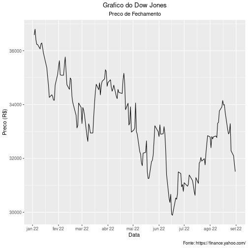

#### 7. Retorno, com base no Preco de Fechamento

```r
  retorno_pf <- (preco_fechamento - shift(preco_fechamento, 1L, type="lag"))/shift(preco_fechamento, 1L, type="lag")
  retorno_pf <- na.omit(retorno_pf)
  tabela_preco_retorno <- cbind(preco_fechamento, retorno_pf)
  head(tabela_preco_retorno)
```

```
##            DJI.Close   DJI.Close.1
## 2022-01-03  36585.06            NA
## 2022-01-04  36799.65  0.0058655050
## 2022-01-05  36407.11 -0.0106669243
## 2022-01-06  36236.47 -0.0046870138
## 2022-01-07  36231.66 -0.0001327004
## 2022-01-10  36068.87 -0.0044930059
```

#### 8. Grafico de linha do Retorno

```r
  ggplot(retorno_pf, aes(x = index(retorno_pf), y = 100*retorno_pf)) +geom_line() +labs(title="Grafico do Dow Jones", subtitle="Retorno", caption="Fonte: https://finance.yahoo.com/", x = "Data ", y="Retorno (%)") +theme(plot.title = element_text(hjust = 0.5), plot.subtitle = element_text(hjust = 0.5)) +scale_x_date(date_labels = "%b %y", date_breaks = "1 month")
```

```
## Don't know how to automatically pick scale for object of type xts/zoo. Defaulting to continuous.
```

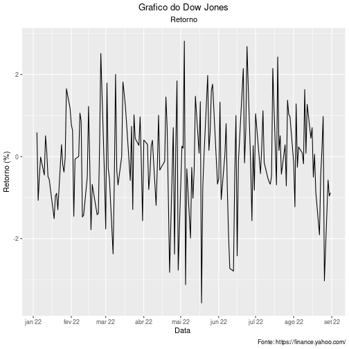

#### 9. Box plot para dados originais (Preco de Fechamento e Retorno) e padronizados

```r
  boxplot_pf <- ggplot(data = preco_fechamento, aes(x = "", y = preco_fechamento))+
                      geom_violin(trim = FALSE, color="blue") +
                      geom_boxplot(width=0.4, color="blue", alpha = 1, outlier.size = 1) +
                      labs(x = "Preco", y = "") +
                      scale_y_continuous(breaks = seq(16, 23, by = 1))

  z_preco_fechamento <- (preco_fechamento - mean(preco_fechamento)) / sd(preco_fechamento)

  boxplot_z_pf <- ggplot(data = z_preco_fechamento, aes(x = "", y = z_preco_fechamento)) +
                        geom_violin(trim = FALSE, color="goldenrod3") +
                        geom_boxplot(width=0.4, color="red", alpha = 1, outlier.size = 1)+
                        labs(x = "Preco Padronizado", y = "") +
                        scale_y_continuous(breaks = seq(-5, 23, by = 1))

  boxplots_pf <- ggarrange(boxplot_pf, boxplot_z_pf,ncol = 2, nrow = 1)
  annotate_figure(boxplots_pf, top = text_grob("Boxplot/Vioplot do Preco de Fechamento\ne Preco de Fechamento Padronizado", color = "Black", face = "bold", size = 14), bottom = text_grob("Fonte: https://finance.yahoo.com/", color = "black", hjust = 1.02, x = 1,size = 10))
```

 e padronizados DJI-1.png)

```r
  boxplot_retorno <- ggplot(data = retorno_pf, aes(x = "", y = 100*retorno_pf)) +
                            geom_violin(trim = FALSE, color="blue") +
                            geom_boxplot(width=0.4, color="blue", alpha = 1, outlier.size = 1) +
                            labs(x = "Retorno (%)", y = "") +
                            scale_y_continuous(breaks = seq(-7, 6, by = 2))

  z_retorno_pf <- (retorno_pf - mean(retorno_pf))/(sd(retorno_pf))

  boxplot_z_retorno_pf <- ggplot(data = z_retorno_pf, aes(x = "", y = z_retorno_pf)) +
                            geom_violin(trim = FALSE, color="red") +
                            geom_boxplot(width=0.4, color="red", alpha = 1, outlier.size = 1) +
                            labs(x = "Retorno Padronizado", y = "") +
                            scale_y_continuous(breaks = seq(-3, 11, by = 2))

  boxplots_retorno <- ggarrange(boxplot_retorno, boxplot_z_retorno_pf,ncol = 2, nrow = 1)
  annotate_figure(boxplots_retorno, top = text_grob("Boxplot/Vioplot do Retorno\ne Retorno Padronizado",
                  color = "Black", face = "bold", size = 14),
                  bottom = text_grob("Fonte: https://finance.yahoo.com/",
                  color = "black", hjust = 1.02, x = 1, size = 10))
```

 e padronizados DJI-2.png)


#### 10. Histograma para dados originais (Preco de Fechamento e Retorno) e padronizados

```r
  histograma_pf <- ggplot(data = preco_fechamento,aes(x = preco_fechamento)) +
                          geom_histogram(color="blue", fill = "white", bins = 30) +
                          labs(y = "Quantidade", x = "Preco") +
                          scale_x_continuous(breaks = seq(17, 22, by = 0.5)) +
                          scale_y_continuous(breaks = seq(0, 30, by = 5)) +
                          theme(plot.title = element_text(hjust = 0.5))

  histograma_z_pf <- ggplot(data = z_preco_fechamento,aes(x = z_preco_fechamento)) +
                            geom_histogram(color="red", fill = "white", bins = 30) +
                            labs(y = "Quantidade", x = "Preco Padronizado") +
                            scale_x_continuous(breaks = seq(-2, 3.5, by = 0.5)) +
                            scale_y_continuous(breaks = seq(0, 50, by = 5)) +
                            theme(plot.title = element_text(hjust = 0.5))

  histogramas_pf <- ggarrange(histograma_pf, histograma_z_pf,ncol = 1, nrow = 2)
  annotate_figure(histogramas_pf, top = text_grob("Histograma do Preco de Fechamento",
                  color = "Black", face = "bold", size = 14),
                  bottom = text_grob("Fonte: https://finance.yahoo.com/",
                  color = "black", hjust = 1.02, x = 1, size = 10))
```

 e padronizados DJI-1.png)

```r
  histograma_retorno <- ggplot(data = retorno_pf,aes(x = 100*retorno_pf)) + 
                                geom_histogram(color="blue", fill = "white", bins = 25) + 
                                labs(y = "Quantidade", x = "Retorno (%)") + 
                                scale_x_continuous(breaks = seq(-6, 6, by = 1)) + 
                                scale_y_continuous(breaks = seq(0, 40, by = 5)) + 
                                theme(plot.title = element_text(hjust = 0.5))

  histograma_z_retorno <- ggplot(data = z_retorno_pf ,aes(x = z_retorno_pf)) + 
                                geom_histogram(color="red", fill = "white", bins = 25) + 
                                labs(y = "Quantidade", x = "Retorno Padronizado") + 
                                scale_x_continuous(breaks = seq(-6, 6, by = 1)) + 
                                scale_y_continuous(breaks = seq(0, 35, by = 5)) + 
                                theme(plot.title = element_text(hjust = 0.5))

  histogramas_retorno <- ggarrange(histograma_retorno, histograma_z_retorno,ncol = 1, nrow = 2)
  annotate_figure(histogramas_retorno, top = text_grob("Histograma do Retorno",
                  color = "Black", face = "bold", size = 14),
                  bottom = text_grob("Fonte: https://finance.yahoo.com/",
                  color = "black", hjust = 1.02, x = 1, size = 10))
```

 e padronizados DJI-2.png)

#### 11. QQPlot do retorno. 

```r
  qqplot_retorno <- ggplot(data = retorno_pf, aes(sample = 100*as.vector(retorno_pf))) +
                          stat_qq(size = 0.6) +labs(x = "Quantis Teoricos", y = "Quantis Amostrais",
                          title = "QQPlot do Retorno (%)") + theme(plot.title = element_text(hjust = 0.5)) +
                          scale_y_continuous(breaks = seq(-6, 4.5, by = 1.5))
```

#### 12. QQLine do retorno (fazer junto com o QQPlot). 

```r
  histograma_retorno_qqplot <- ggplot(data = retorno_pf,aes(x = 100*retorno_pf)) +
                                      geom_histogram(aes(y=..density..),color="blue", fill = "white", bins = 25) +
                                      stat_function(fun = dnorm, args = list(mean = mean(100*retorno_pf), sd = sd(100*retorno_pf)),
                                      col="red",lwd=1)+ theme(axis.text.x = element_blank(), axis.text.y = element_blank()) +
                                      labs(y = "", x = "") 

  qqplot_linha_retorno <- ggplot(data = retorno_pf, aes(sample = 100*as.vector(retorno_pf))) +
                                stat_qq(size = 0.6) + labs(x = "Quantis Teoricos", y = "Quantis Amostrais", title = "QQPlot do Retorno (%)") +
                                theme(plot.title = element_text(hjust = 0.5)) +scale_y_continuous(breaks = seq(-6, 4.5, by = 1.5)) +
                                stat_qq_line(col = 2,lwd=1,lty=1) 

  plot_principal <- qqplot_linha_retorno

  plot_para_inserir <- histograma_retorno_qqplot

  plot.com.insercao <- ggdraw() + draw_plot(plot_principal) + draw_plot(plot_para_inserir, x = 0.07, y = 0.6, width = .3, height = .3)
```

```
## Don't know how to automatically pick scale for object of type xts/zoo. Defaulting to continuous.
```

```r
  plot.com.insercao
```

. DJI-1.png)

#### 13. Assimetria amostral n?o viesada do retorno.  

```r
  n <- length(retorno_pf)
  somatorio <- c()
  for(i in 1:n){
    somatorio[i] <- ((retorno_pf[i] - mean(retorno_pf))/ sd(retorno_pf))^3
  }
  p1_s3 <- n/((n -1)*(n-2))
  p2_s3 <- sum(somatorio)
  s3 <- p1_s3*p2_s3
  s3
```

```
## [1] -0.2224268
```

#### 14. Curtose amostral n?o viesada do retorno.  

```r
  n <- length(retorno_pf)
  somatorio <- c()
  for(i in 1:n){
    somatorio[i] <- ((retorno_pf[i] - mean(retorno_pf))/ sd(retorno_pf))^4
  }
  p1_s4 <- (n*(n +1))/((n -1)*(n-2)*(n-3))
  p2_s4 <- (sum(somatorio))
  p3_s4 <- (3*((n-1)^2))/((n-2)*(n-3))
  s4 <- p1_s4 * p2_s4 - p3_s4
  s4
```

```
## [1] 0.243152
```

>### Dados NASDAQ

```r
  dados.nasdaq <- quantmod::getSymbols("^IXIC", src = "yahoo", from = start, to = end, auto.assign = FALSE)
  nasdaq <- na.omit(dados.nasdaq)
```

#### Cria o vetor de preco de fechamento

```r
  preco_fechamento <- dados.nasdaq$"IXIC.Close"
```

#### 1. Media do Preco de Fechamento 

```r
  media_pf <- mean(preco_fechamento)
  media_pf
```

```
## [1] 12848.57
```

#### 2. Moda do Preco de Fechamento 

```r
  tab_preco_fechamento <- table(preco_fechamento)
  moda_pf <- names(tab_preco_fechamento)[which(tab_preco_fechamento==max(tab_preco_fechamento))]
  moda_pf
```

```
##   [1] "10646.099609" "10798.349609" "10809.230469" "10828.349609" "11028.740234"
##   [6] "11053.080078" "11069.299805" "11099.150391" "11127.849609" "11177.889648"
##  [11] "11181.540039" "11232.19043"  "11247.580078" "11251.19043"  "11264.450195"
##  [16] "11264.730469" "11322.240234" "11340.019531" "11354.620117" "11360.049805"
##  [21] "11361.849609" "11364.240234" "11370.959961" "11372.599609" "11388.5"     
##  [26] "11418.150391" "11434.740234" "11452.419922" "11524.549805" "11535.269531"
##  [31] "11562.570313" "11607.620117" "11621.349609" "11623.25"     "11635.30957" 
##  [36] "11662.790039" "11713.150391" "11737.669922" "11740.650391" "11754.230469"
##  [41] "11782.669922" "11805"        "11816.200195" "11834.110352" "11883.139648"
##  [46] "11897.650391" "11984.519531" "11994.459961" "12012.730469" "12017.669922"
##  [51] "12032.419922" "12059.610352" "12061.370117" "12081.389648" "12086.269531"
##  [56] "12131.129883" "12141.709961" "12144.660156" "12162.589844" "12175.230469"
##  [61] "12316.900391" "12317.69043"  "12334.639648" "12348.759766" "12368.980469"
##  [66] "12381.299805" "12381.570313" "12390.69043"  "12431.530273" "12488.929688"
##  [71] "12490.740234" "12493.929688" "12536.019531" "12563.759766" "12581.219727"
##  [76] "12639.269531" "12644.459961" "12657.549805" "12668.160156" "12705.219727"
##  [81] "12720.580078" "12779.910156" "12795.549805" "12830.959961" "12839.290039"
##  [86] "12843.80957"  "12854.799805" "12871.530273" "12938.120117" "12948.620117"
##  [91] "12964.860352" "12965.339844" "13004.849609" "13037.490234" "13047.19043" 
##  [96] "13102.549805" "13128.049805" "13129.959961" "13174.650391" "13255.549805"
## [101] "13313.44043"  "13332.360352" "13351.080078" "13352.780273" "13371.570313"
## [106] "13381.519531" "13411.959961" "13436.549805" "13453.070313" "13473.589844"
## [111] "13532.459961" "13537.94043"  "13539.290039" "13542.120117" "13548.070313"
## [116] "13614.780273" "13619.660156" "13643.589844" "13694.620117" "13711"       
## [121] "13716.719727" "13751.400391" "13752.019531" "13768.919922" "13770.570313"
## [126] "13790.919922" "13791.150391" "13838.459961" "13855.129883" "13878.820313"
## [131] "13888.820313" "13893.839844" "13897.299805" "13922.599609" "14015.669922"
## [136] "14098.009766" "14108.820313" "14124.089844" "14139.759766" "14154.019531"
## [141] "14169.299805" "14185.639648" "14191.839844" "14194.450195" "14204.169922"
## [146] "14220.519531" "14239.879883" "14261.5"      "14340.259766" "14346"       
## [151] "14354.900391" "14417.549805" "14442.269531" "14490.370117" "14506.900391"
## [156] "14532.549805" "14619.639648" "14806.80957"  "14893.75"     "14935.900391"
## [161] "14942.830078" "15080.860352" "15100.169922" "15153.450195" "15188.389648"
## [166] "15622.719727" "15832.799805"
```

#### 3. Mediana do Preco de Fechamento 

```r
  mediana_pf <- median(preco_fechamento)
  mediana_pf
```

```
## [1] 12830.96
```

#### 4. Variancia Nao Viesada 

```r
  variancia_pf <- var(preco_fechamento)
  variancia_pf
```

```
##            IXIC.Close
## IXIC.Close    1424894
```

#### 5. Desvio-padrao 

```r
  desv_pad_pf <- sd(preco_fechamento)
  desv_pad_pf
```

```
## [1] 1193.689
```

#### 6. Grafico de linha do Preco de Fechamento 

```r
  ggplot(dados.nasdaq, aes(x = index(dados.nasdaq), y = preco_fechamento)) + geom_line() +
        labs(title="Grafico do NASDAQ", subtitle="Preco de Fechamento", caption="Fonte: https://finance.yahoo.com/", x = "Data ", y="Preco (R$)") +
        theme(plot.title = element_text(hjust = 0.5), plot.subtitle = element_text(hjust = 0.5)) +
        scale_x_date(date_labels = "%b %y", date_breaks = "1 month")
```

```
## Don't know how to automatically pick scale for object of type xts/zoo. Defaulting to continuous.
```

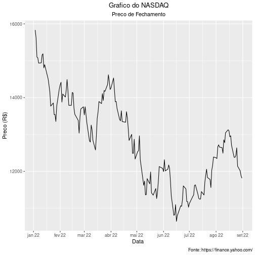

#### 7. Retorno, com base no Preco de Fechamento 

```r
  retorno_pf <- (preco_fechamento - shift(preco_fechamento, 1L, type="lag"))/shift(preco_fechamento, 1L, type="lag")
  retorno_pf <- na.omit(retorno_pf)
  tabela_preco_retorno <- cbind(preco_fechamento, retorno_pf)
  head(tabela_preco_retorno)
```

```
##            IXIC.Close  IXIC.Close.1
## 2022-01-03   15832.80            NA
## 2022-01-04   15622.72 -0.0132686626
## 2022-01-05   15100.17 -0.0334480688
## 2022-01-06   15080.86 -0.0012787651
## 2022-01-07   14935.90 -0.0096121811
## 2022-01-10   14942.83  0.0004639618
```

#### 8. Grafico de linha do Retorno 

```r
  ggplot(retorno_pf, aes(x = index(retorno_pf), y = 100*retorno_pf)) + geom_line() +
        labs(title="Grafico do NASDAQ", subtitle="Retorno", caption="Fonte: https://finance.yahoo.com/", x = "Data ", y="Retorno (%)") +
        theme(plot.title = element_text(hjust = 0.5), plot.subtitle = element_text(hjust = 0.5)) +
        scale_x_date(date_labels = "%b %y", date_breaks = "1 month")
```

```
## Don't know how to automatically pick scale for object of type xts/zoo. Defaulting to continuous.
```

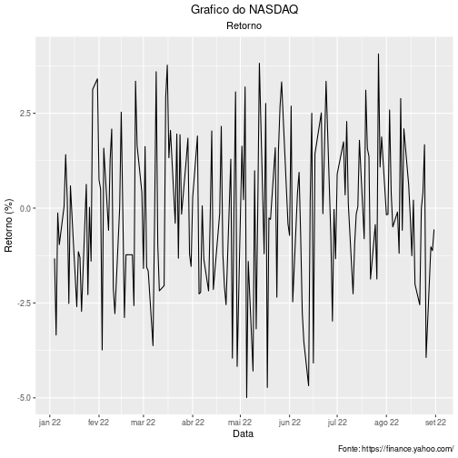

#### 9. Box plot para dados originais (Preco de Fechamento e Retorno) e padronizados 

```r
  boxplot_pf <- ggplot(data = preco_fechamento, aes(x = "", y = preco_fechamento))+
                      geom_violin(trim = FALSE, color="blue") +
                      geom_boxplot(width=0.4, color="blue", alpha = 1, outlier.size = 1) +
                      labs(x = "Preco", y = "") +
                      scale_y_continuous(breaks = seq(16, 23, by = 1))

  z_preco_fechamento <- (preco_fechamento - mean(preco_fechamento)) / sd(preco_fechamento)

  boxplot_z_pf <- ggplot(data = z_preco_fechamento, aes(x = "", y = z_preco_fechamento)) +
                        geom_violin(trim = FALSE, color="goldenrod3") +
                        geom_boxplot(width=0.4, color="red", alpha = 1, outlier.size = 1)+
                        labs(x = "Preco Padronizado", y = "") +
                        scale_y_continuous(breaks = seq(-5, 23, by = 1))

  boxplots_pf <- ggarrange(boxplot_pf, boxplot_z_pf,ncol = 2, nrow = 1)
  annotate_figure(boxplots_pf, top = text_grob("Boxplot/Vioplot do Preco de Fechamento\ne Preco de Fechamento Padronizado", color = "Black", face = "bold", size = 14),
                  bottom = text_grob("Fonte: https://finance.yahoo.com/", color = "black", hjust = 1.02, x = 1,size = 10))
```

 e padronizados IXIC-1.png)

```r
  boxplot_retorno <- ggplot(data = retorno_pf, aes(x = "", y = 100*retorno_pf)) +
                            geom_violin(trim = FALSE, color="blue") +
                            geom_boxplot(width=0.4, color="blue", alpha = 1, outlier.size = 1) +
                            labs(x = "Retorno (%)", y = "") +
                            scale_y_continuous(breaks = seq(-7, 6, by = 2))

  z_retorno_pf <- (retorno_pf - mean(retorno_pf))/(sd(retorno_pf))

  boxplot_z_retorno_pf <- ggplot(data = z_retorno_pf, aes(x = "", y = z_retorno_pf)) +
                            geom_violin(trim = FALSE, color="red") +
                            geom_boxplot(width=0.4, color="red", alpha = 1, outlier.size = 1) +
                            labs(x = "Retorno Padronizado", y = "") +
                            scale_y_continuous(breaks = seq(-3, 11, by = 2))

  boxplots_retorno <- ggarrange(boxplot_retorno, boxplot_z_retorno_pf,ncol = 2, nrow = 1)
  annotate_figure(boxplots_retorno, top = text_grob("Boxplot/Vioplot do Retorno\ne Retorno Padronizado",
                  color = "Black", face = "bold", size = 14),
                  bottom = text_grob("Fonte: https://finance.yahoo.com/",
                  color = "black", hjust = 1.02, x = 1, size = 10))
```

 e padronizados IXIC-2.png)


#### 10. Histograma para dados originais (Preco de Fechamento e Retorno) e padronizados 

```r
  histograma_pf <- ggplot(data = preco_fechamento,aes(x = preco_fechamento)) +
                          geom_histogram(color="blue", fill = "white", bins = 30) +
                          labs(y = "Quantidade", x = "Preco") +
                          scale_x_continuous(breaks = seq(17, 22, by = 0.5)) +
                          scale_y_continuous(breaks = seq(0, 30, by = 5)) +
                          theme(plot.title = element_text(hjust = 0.5))

  histograma_z_pf <- ggplot(data = z_preco_fechamento,aes(x = z_preco_fechamento)) +
                            geom_histogram(color="red", fill = "white", bins = 30) +
                            labs(y = "Quantidade", x = "Preco Padronizado") +
                            scale_x_continuous(breaks = seq(-2, 3.5, by = 0.5)) +
                            scale_y_continuous(breaks = seq(0, 50, by = 5)) +
                            theme(plot.title = element_text(hjust = 0.5))

  histogramas_pf <- ggarrange(histograma_pf, histograma_z_pf,ncol = 1, nrow = 2)
  annotate_figure(histogramas_pf, top = text_grob("Histograma do Preco de Fechamento",
                  color = "Black", face = "bold", size = 14),
                  bottom = text_grob("Fonte: https://finance.yahoo.com/",
                  color = "black", hjust = 1.02, x = 1, size = 10))
```

 e padronizados IXIC-1.png)

```r
  histograma_retorno <- ggplot(data = retorno_pf,aes(x = 100*retorno_pf)) + 
                                geom_histogram(color="blue", fill = "white", bins = 25) + 
                                labs(y = "Quantidade", x = "Retorno (%)") + 
                                scale_x_continuous(breaks = seq(-6, 6, by = 1)) + 
                                scale_y_continuous(breaks = seq(0, 40, by = 5)) + 
                                theme(plot.title = element_text(hjust = 0.5))

  histograma_z_retorno <- ggplot(data = z_retorno_pf ,aes(x = z_retorno_pf)) + 
                                geom_histogram(color="red", fill = "white", bins = 25) + 
                                labs(y = "Quantidade", x = "Retorno Padronizado") + 
                                scale_x_continuous(breaks = seq(-6, 6, by = 1)) + 
                                scale_y_continuous(breaks = seq(0, 35, by = 5)) + 
                                theme(plot.title = element_text(hjust = 0.5))

  histogramas_retorno <- ggarrange(histograma_retorno, histograma_z_retorno,ncol = 1, nrow = 2)
  annotate_figure(histogramas_retorno, top = text_grob("Histograma do Retorno",
                  color = "Black", face = "bold", size = 14),
                  bottom = text_grob("Fonte: https://finance.yahoo.com/",
                  color = "black", hjust = 1.02, x = 1, size = 10))
```

 e padronizados IXIC-2.png)

#### 11. QQPlot do retorno.  

```r
  qqplot_retorno <- ggplot(data = retorno_pf, aes(sample = 100*as.vector(retorno_pf))) +
                          stat_qq(size = 0.6) +labs(x = "Quantis Teoricos", y = "Quantis Amostrais",
                          title = "QQPlot do Retorno (%)") + theme(plot.title = element_text(hjust = 0.5)) +
                          scale_y_continuous(breaks = seq(-6, 4.5, by = 1.5))
```

#### 12. QQLine do retorno (fazer junto com o QQPlot).  

```r
  histograma_retorno_qqplot <- ggplot(data = retorno_pf,aes(x = 100*retorno_pf)) +
                                      geom_histogram(aes(y=..density..),color="blue", fill = "white", bins = 25) +
                                      stat_function(fun = dnorm, args = list(mean = mean(100*retorno_pf), sd = sd(100*retorno_pf)),
                                      col="red",lwd=1)+ theme(axis.text.x = element_blank(), axis.text.y = element_blank()) +
                                      labs(y = "", x = "") 

  qqplot_linha_retorno <- ggplot(data = retorno_pf, aes(sample = 100*as.vector(retorno_pf))) +
                                stat_qq(size = 0.6) + labs(x = "Quantis Teoricos", y = "Quantis Amostrais", title = "QQPlot do Retorno (%)") +
                                theme(plot.title = element_text(hjust = 0.5)) +scale_y_continuous(breaks = seq(-6, 4.5, by = 1.5)) +
                                stat_qq_line(col = 2,lwd=1,lty=1) 

  plot_principal <- qqplot_linha_retorno

  plot_para_inserir <- histograma_retorno_qqplot

  plot.com.insercao <- ggdraw() + draw_plot(plot_principal) + draw_plot(plot_para_inserir, x = 0.07, y = 0.6, width = .3, height = .3)
```

```
## Don't know how to automatically pick scale for object of type xts/zoo. Defaulting to continuous.
```

```r
  plot.com.insercao
```

. IXIC-1.png)

#### 13. Assimetria amostral nao viesada do retorno.   

```r
  n <- length(retorno_pf)
  somatorio <- c()
  for(i in 1:n){
    somatorio[i] <- ((retorno_pf[i] - mean(retorno_pf))/ sd(retorno_pf))^3
  }
  p1_s3 <- n/((n -1)*(n-2))
  p2_s3 <- sum(somatorio)
  s3 <- p1_s3*p2_s3
  s3
```

```
## [1] -0.09559649
```

#### 14. Curtose amostral nao viesada do retorno.   

```r
  n <- length(retorno_pf)
  somatorio <- c()
  for(i in 1:n){
    somatorio[i] <- ((retorno_pf[i] - mean(retorno_pf))/ sd(retorno_pf))^4
  }
  p1_s4 <- (n*(n +1))/((n -1)*(n-2)*(n-3))
  p2_s4 <- (sum(somatorio))
  p3_s4 <- (3*((n-1)^2))/((n-2)*(n-3))
  s4 <- p1_s4 * p2_s4 - p3_s4
  s4
```

```
## [1] -0.5844527
```

>### Dados Bovespa

```r
  dados.bovespa <- quantmod::getSymbols("^BVSP", src = "yahoo", from = start, to = end, auto.assign = FALSE)
  bovespa <- na.omit(dados.bovespa)
```

#### Cria o vetor de preco de fechamento

```r
  preco_fechamento <- dados.bovespa$"BVSP.Close"
```

#### 1. Media do Preco de Fechamento

```r
  media_pf <- mean(preco_fechamento)
  media_pf
```

```
## [1] 108733.9
```

#### 2. Moda do Preco de Fechamento

```r
  tab_preco_fechamento <- table(preco_fechamento)
  moda_pf <- names(tab_preco_fechamento)[which(tab_preco_fechamento==max(tab_preco_fechamento))]
  moda_pf
```

```
##   [1] "96121"  "96551"  "96916"  "97881"  "98080"  "98212"  "98245"  "98271"  "98287" 
##  [10] "98295"  "98542"  "98609"  "98672"  "98719"  "98925"  "98954"  "99033"  "99522" 
##  [19] "99622"  "99685"  "99772"  "99825"  "99853"  "100270" "100289" "100591" "100730"
##  [28] "100764" "101006" "101438" "101561" "101945" "102063" "102225" "102597" "102598"
##  [37] "102719" "102807" "103110" "103165" "103250" "103362" "103514" "103775" "103779"
##  [46] "103922" "104397" "105135" "105304" "105481" "105530" "105686" "105688" "105892"
##  [55] "106247" "106472" "106522" "106528" "106639" "106692" "106924" "106928" "107005"
##  [64] "107094" "107752" "107876" "108013" "108213" "108233" "108344" "108368" "108402"
##  [73] "108488" "108651" "108789" "108942" "108959" "109102" "109349" "109523" "109718"
##  [82] "109845" "109919" "109928" "110070" "110186" "110236" "110346" "110431" "110501"
##  [91] "110580" "110581" "110685" "111032" "111078" "111102" "111112" "111203" "111351"
## [100] "111360" "111478" "111496" "111573" "111592" "111593" "111696" "111713" "111725"
## [109] "111890" "111942" "111996" "112008" "112161" "112234" "112245" "112299" "112315"
## [118] "112323" "112388" "112393" "112461" "112764" "112768" "112857" "112892" "112898"
## [127] "113032" "113076" "113142" "113147" "113359" "113512" "113528" "113532" "113572"
## [136] "113663" "113708" "113807" "113813" "113900" "114344" "114474" "114660" "115057"
## [145] "115166" "115174" "115181" "115311" "115687" "116147" "116155" "116182" "116782"
## [154] "116953" "117272" "117457" "118228" "118322" "118738" "118862" "118885" "119053"
## [163] "119081" "119999" "120014" "120260" "121280" "121570"
```

#### 3. Mediana do Preco de Fechamento

```r
  mediana_pf <- median(preco_fechamento)
  mediana_pf
```

```
## [1] 109999
```

#### 4. Variancia Nao Viesada

```r
  variancia_pf <- var(preco_fechamento)
  variancia_pf
```

```
##            BVSP.Close
## BVSP.Close   38669231
```

#### 5. Desvio-padrao

```r
  desv_pad_pf <- sd(preco_fechamento)
  desv_pad_pf
```

```
## [1] 6218.459
```

#### 6. Grafico de linha do Preco de Fechamento

```r
  ggplot(dados.bovespa, aes(x = index(dados.bovespa), y = preco_fechamento)) + geom_line() +
        labs(title="Grafico do Bovespa", subtitle="Preco de Fechamento", caption="Fonte: https://finance.yahoo.com/", x = "Data ", y="Preco (R$)") +
        theme(plot.title = element_text(hjust = 0.5), plot.subtitle = element_text(hjust = 0.5)) +
        scale_x_date(date_labels = "%b %y", date_breaks = "1 month")
```

```
## Don't know how to automatically pick scale for object of type xts/zoo. Defaulting to continuous.
```

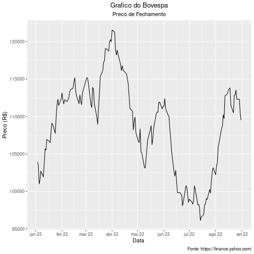

#### 7. Retorno, com base no Preco de Fechamento

```r
  retorno_pf <- (preco_fechamento - shift(preco_fechamento, 1L, type="lag"))/shift(preco_fechamento, 1L, type="lag")
  retorno_pf <- na.omit(retorno_pf)
  tabela_preco_retorno <- cbind(preco_fechamento, retorno_pf)
  head(tabela_preco_retorno)
```

```
##            BVSP.Close BVSP.Close.1
## 2022-01-03     103922           NA
## 2022-01-04     103514 -0.003926021
## 2022-01-05     101006 -0.024228607
## 2022-01-06     101561  0.005494723
## 2022-01-07     102719  0.011402015
## 2022-01-10     101945 -0.007535120
```

#### 8. Grafico de linha do Retorno

```r
  ggplot(retorno_pf, aes(x = index(retorno_pf), y = 100*retorno_pf)) + geom_line() +
        labs(title="Grafico do Bovespa", subtitle="Retorno", caption="Fonte: https://finance.yahoo.com/", x = "Data ", y="Retorno (%)") +
        theme(plot.title = element_text(hjust = 0.5), plot.subtitle = element_text(hjust = 0.5)) +
        scale_x_date(date_labels = "%b %y", date_breaks = "1 month")
```

```
## Don't know how to automatically pick scale for object of type xts/zoo. Defaulting to continuous.
```

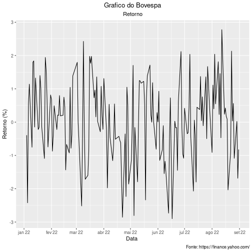

#### 9. Box plot para dados originais (Preco de Fechamento e Retorno) e padronizados

```r
  boxplot_pf <- ggplot(data = preco_fechamento, aes(x = "", y = preco_fechamento))+
                      geom_violin(trim = FALSE, color="blue") +
                      geom_boxplot(width=0.4, color="blue", alpha = 1, outlier.size = 1) +
                      labs(x = "Preco", y = "") +
                      scale_y_continuous(breaks = seq(16, 23, by = 1))

  z_preco_fechamento <- (preco_fechamento - mean(preco_fechamento)) / sd(preco_fechamento)

  boxplot_z_pf <- ggplot(data = z_preco_fechamento, aes(x = "", y = z_preco_fechamento)) +
                        geom_violin(trim = FALSE, color="goldenrod3") +
                        geom_boxplot(width=0.4, color="red", alpha = 1, outlier.size = 1)+
                        labs(x = "Preco Padronizado", y = "") +
                        scale_y_continuous(breaks = seq(-5, 23, by = 1))

  boxplots_pf <- ggarrange(boxplot_pf, boxplot_z_pf,ncol = 2, nrow = 1)
  annotate_figure(boxplots_pf, top = text_grob("Boxplot/Vioplot do Preco de Fechamento\ne Preco de Fechamento Padronizado", color = "Black", face = "bold", size = 14),
                  bottom = text_grob("Fonte: https://finance.yahoo.com/", color = "black", hjust = 1.02, x = 1,size = 10))
```

 e padronizados BVSP-1.png)

```r
  boxplot_retorno <- ggplot(data = retorno_pf, aes(x = "", y = 100*retorno_pf)) +
                            geom_violin(trim = FALSE, color="blue") +
                            geom_boxplot(width=0.4, color="blue", alpha = 1, outlier.size = 1) +
                            labs(x = "Retorno (%)", y = "") +
                            scale_y_continuous(breaks = seq(-7, 6, by = 2))

  z_retorno_pf <- (retorno_pf - mean(retorno_pf))/(sd(retorno_pf))

  boxplot_z_retorno_pf <- ggplot(data = z_retorno_pf, aes(x = "", y = z_retorno_pf)) +
                            geom_violin(trim = FALSE, color="red") +
                            geom_boxplot(width=0.4, color="red", alpha = 1, outlier.size = 1) +
                            labs(x = "Retorno Padronizado", y = "") +
                            scale_y_continuous(breaks = seq(-3, 11, by = 2))

  boxplots_retorno <- ggarrange(boxplot_retorno, boxplot_z_retorno_pf,ncol = 2, nrow = 1)
  annotate_figure(boxplots_retorno, top = text_grob("Boxplot/Vioplot do Retorno\ne Retorno Padronizado",
                  color = "Black", face = "bold", size = 14),
                  bottom = text_grob("Fonte: https://finance.yahoo.com/",
                  color = "black", hjust = 1.02, x = 1, size = 10))
```

 e padronizados BVSP-2.png)


#### 10. Histograma para dados originais (Preco de Fechamento e Retorno) e padronizados

```r
  histograma_pf <- ggplot(data = preco_fechamento,aes(x = preco_fechamento)) +
                          geom_histogram(color="blue", fill = "white", bins = 30) +
                          labs(y = "Quantidade", x = "Preco") +
                          scale_x_continuous(breaks = seq(17, 22, by = 0.5)) +
                          scale_y_continuous(breaks = seq(0, 30, by = 5)) +
                          theme(plot.title = element_text(hjust = 0.5))

  histograma_z_pf <- ggplot(data = z_preco_fechamento,aes(x = z_preco_fechamento)) +
                            geom_histogram(color="red", fill = "white", bins = 30) +
                            labs(y = "Quantidade", x = "Preco Padronizado") +
                            scale_x_continuous(breaks = seq(-2, 3.5, by = 0.5)) +
                            scale_y_continuous(breaks = seq(0, 50, by = 5)) +
                            theme(plot.title = element_text(hjust = 0.5))

  histogramas_pf <- ggarrange(histograma_pf, histograma_z_pf,ncol = 1, nrow = 2)
  annotate_figure(histogramas_pf, top = text_grob("Histograma do Preco de Fechamento",
                  color = "Black", face = "bold", size = 14),
                  bottom = text_grob("Fonte: https://finance.yahoo.com/",
                  color = "black", hjust = 1.02, x = 1, size = 10))
```

 e padronizados BVSP-1.png)

```r
  histograma_retorno <- ggplot(data = retorno_pf,aes(x = 100*retorno_pf)) + 
                                geom_histogram(color="blue", fill = "white", bins = 25) + 
                                labs(y = "Quantidade", x = "Retorno (%)") + 
                                scale_x_continuous(breaks = seq(-6, 6, by = 1)) + 
                                scale_y_continuous(breaks = seq(0, 40, by = 5)) + 
                                theme(plot.title = element_text(hjust = 0.5))

  histograma_z_retorno <- ggplot(data = z_retorno_pf ,aes(x = z_retorno_pf)) + 
                                geom_histogram(color="red", fill = "white", bins = 25) + 
                                labs(y = "Quantidade", x = "Retorno Padronizado") + 
                                scale_x_continuous(breaks = seq(-6, 6, by = 1)) + 
                                scale_y_continuous(breaks = seq(0, 35, by = 5)) + 
                                theme(plot.title = element_text(hjust = 0.5))

  histogramas_retorno <- ggarrange(histograma_retorno, histograma_z_retorno,ncol = 1, nrow = 2)
  annotate_figure(histogramas_retorno, top = text_grob("Histograma do Retorno",
                  color = "Black", face = "bold", size = 14),
                  bottom = text_grob("Fonte: https://finance.yahoo.com/",
                  color = "black", hjust = 1.02, x = 1, size = 10))
```

 e padronizados BVSP-2.png)

#### 11. QQPlot do retorno. 

```r
  qqplot_retorno <- ggplot(data = retorno_pf, aes(sample = 100*as.vector(retorno_pf))) +
                          stat_qq(size = 0.6) +labs(x = "Quantis Teoricos", y = "Quantis Amostrais",
                          title = "QQPlot do Retorno (%)") + theme(plot.title = element_text(hjust = 0.5)) +
                          scale_y_continuous(breaks = seq(-6, 4.5, by = 1.5))
```

#### 12. QQLine do retorno (fazer junto com o QQPlot). 

```r
  histograma_retorno_qqplot <- ggplot(data = retorno_pf,aes(x = 100*retorno_pf)) +
                                      geom_histogram(aes(y=..density..),color="blue", fill = "white", bins = 25) +
                                      stat_function(fun = dnorm, args = list(mean = mean(100*retorno_pf), sd = sd(100*retorno_pf)),
                                      col="red",lwd=1)+ theme(axis.text.x = element_blank(), axis.text.y = element_blank()) +
                                      labs(y = "", x = "") 

  qqplot_linha_retorno <- ggplot(data = retorno_pf, aes(sample = 100*as.vector(retorno_pf))) +
                                stat_qq(size = 0.6) + labs(x = "Quantis Teoricos", y = "Quantis Amostrais", title = "QQPlot do Retorno (%)") +
                                theme(plot.title = element_text(hjust = 0.5)) +scale_y_continuous(breaks = seq(-6, 4.5, by = 1.5)) +
                                stat_qq_line(col = 2,lwd=1,lty=1) 

  plot_principal <- qqplot_linha_retorno

  plot_para_inserir <- histograma_retorno_qqplot

  plot.com.insercao <- ggdraw() + draw_plot(plot_principal) + draw_plot(plot_para_inserir, x = 0.07, y = 0.6, width = .3, height = .3)
```

```
## Don't know how to automatically pick scale for object of type xts/zoo. Defaulting to continuous.
```

```r
  plot.com.insercao
```

. BVSP-1.png)

#### 13. Assimetria amostral nao viesada do retorno.  

```r
  n <- length(retorno_pf)
  somatorio <- c()
  for(i in 1:n){
    somatorio[i] <- ((retorno_pf[i] - mean(retorno_pf))/ sd(retorno_pf))^3
  }
  p1_s3 <- n/((n -1)*(n-2))
  p2_s3 <- sum(somatorio)
  s3 <- p1_s3*p2_s3
  s3
```

```
## [1] -0.2600852
```

#### 14. Curtose amostral nao viesada do retorno.  

```r
  n <- length(retorno_pf)
  somatorio <- c()
  for(i in 1:n){
    somatorio[i] <- ((retorno_pf[i] - mean(retorno_pf))/ sd(retorno_pf))^4
  }
  p1_s4 <- (n*(n +1))/((n -1)*(n-2)*(n-3))
  p2_s4 <- (sum(somatorio))
  p3_s4 <- (3*((n-1)^2))/((n-2)*(n-3))
  s4 <- p1_s4 * p2_s4 - p3_s4
  s4
```

```
## [1] -0.1607262
```

>### Dados Petroleo Brent

```r
  dados.brent <- quantmod::getSymbols("BZ=F", src = "yahoo", from = start, to = end, auto.assign = FALSE)
```

```
## Warning: BZ=F contains missing values. Some functions will not work if objects contain
## missing values in the middle of the series. Consider using na.omit(), na.approx(),
## na.fill(), etc to remove or replace them.
```

```r
  brent <- na.omit(dados.brent)
```

#### Cria o vetor de preco de fechamento

```r
  preco_fechamento <- dados.brent$"BZ=F.Close"
```

#### 1. Media do Preco de Fechamento 

```r
  media_pf <- mean(preco_fechamento)
  media_pf
```

```
## [1] NA
```

#### 2. Moda do Preco de Fechamento 

```r
  tab_preco_fechamento <- table(preco_fechamento)
  moda_pf <- names(tab_preco_fechamento)[which(tab_preco_fechamento==max(tab_preco_fechamento))]
  moda_pf
```

```
## [1] "96.480003"  "96.839996"  "100.989998" "106.639999" "113.120003"
```

#### 3. Mediana do Preco de Fechamento 

```r
  mediana_pf <- median(preco_fechamento)
  mediana_pf
```

```
## [1] NA
```

#### 4. Variancia Nao Viesada 

```r
  variancia_pf <- var(preco_fechamento)
  variancia_pf
```

```
##            BZ=F.Close
## BZ=F.Close         NA
```

#### 5. Desvio-padrao 

```r
  desv_pad_pf <- sd(preco_fechamento)
  desv_pad_pf
```

```
## [1] NA
```

#### 6. Grafico de linha do Preco de Fechamento 

```r
  ggplot(dados.brent, aes(x = index(dados.brent), y = preco_fechamento)) + geom_line() +
        labs(title="Grafico do Petroleo Brent", subtitle="Preco de Fechamento", caption="Fonte: https://finance.yahoo.com/", x = "Data ", y="Preco (R$)") +
        theme(plot.title = element_text(hjust = 0.5), plot.subtitle = element_text(hjust = 0.5)) +
        scale_x_date(date_labels = "%b %y", date_breaks = "1 month")
```

```
## Don't know how to automatically pick scale for object of type xts/zoo. Defaulting to continuous.
```

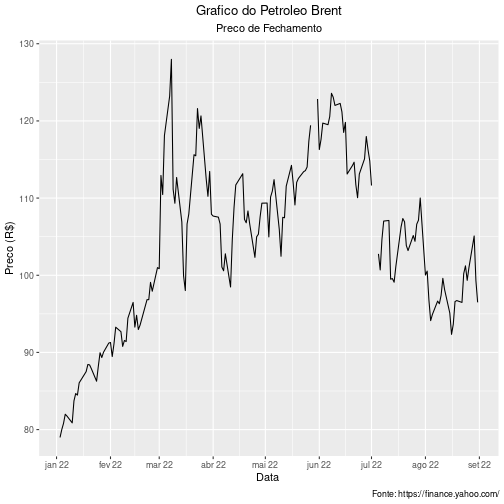

#### 7. Retorno, com base no Preco de Fechamento 

```r
  retorno_pf <- (preco_fechamento - shift(preco_fechamento, 1L, type="lag"))/shift(preco_fechamento, 1L, type="lag")
  retorno_pf <- na.omit(retorno_pf)
  tabela_preco_retorno <- cbind(preco_fechamento, retorno_pf)
  head(tabela_preco_retorno)
```

```
##            BZ.F.Close BZ.F.Close.1
## 2022-01-03      78.98           NA
## 2022-01-04      80.00  0.012914623
## 2022-01-05      80.80  0.010000038
## 2022-01-06      81.99  0.014727660
## 2022-01-07      81.75 -0.002927162
## 2022-01-10      80.87 -0.010764489
```

#### 8. Grafico de linha do Retorno 

```r
  ggplot(retorno_pf, aes(x = index(retorno_pf), y = 100*retorno_pf)) + geom_line() +
        labs(title="Grafico do Petroleo Brent", subtitle="Retorno", caption="Fonte: https://finance.yahoo.com/", x = "Data ", y="Retorno (%)") +
        theme(plot.title = element_text(hjust = 0.5), plot.subtitle = element_text(hjust = 0.5)) +
        scale_x_date(date_labels = "%b %y", date_breaks = "1 month")
```

```
## Don't know how to automatically pick scale for object of type xts/zoo. Defaulting to continuous.
```

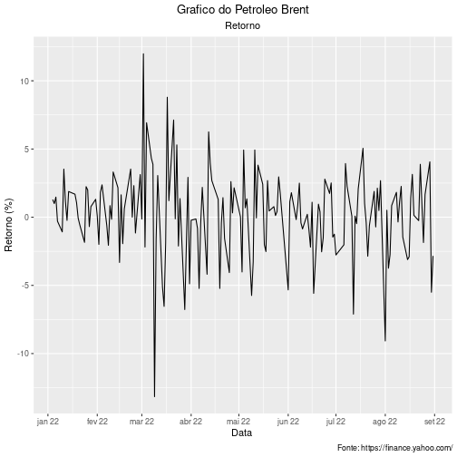

#### 9. Box plot para dados originais (Preco de Fechamento e Retorno) e padronizados 

```r
  boxplot_pf <- ggplot(data = preco_fechamento, aes(x = "", y = preco_fechamento))+
                      geom_violin(trim = FALSE, color="blue") +
                      geom_boxplot(width=0.4, color="blue", alpha = 1, outlier.size = 1) +
                      labs(x = "Preco", y = "") +
                      scale_y_continuous(breaks = seq(16, 23, by = 1))

  z_preco_fechamento <- (preco_fechamento - mean(preco_fechamento)) / sd(preco_fechamento)

  boxplot_z_pf <- ggplot(data = z_preco_fechamento, aes(x = "", y = z_preco_fechamento)) +
                        geom_violin(trim = FALSE, color="goldenrod3") +
                        geom_boxplot(width=0.4, color="red", alpha = 1, outlier.size = 1)+
                        labs(x = "Preco Padronizado", y = "") +
                        scale_y_continuous(breaks = seq(-5, 23, by = 1))

  boxplots_pf <- ggarrange(boxplot_pf, boxplot_z_pf,ncol = 2, nrow = 1)
```

```
## Warning: Removed 2 rows containing non-finite values (stat_ydensity).
```

```
## Warning: Removed 2 rows containing non-finite values (stat_boxplot).
```

```
## Warning: Removed 170 rows containing non-finite values (stat_ydensity).
```

```
## Warning in max(data$density): no non-missing arguments to max; returning -Inf
```

```
## Warning: Computation failed in `stat_ydensity()`:
## replacement has 1 row, data has 0
```

```
## Warning: Removed 170 rows containing non-finite values (stat_boxplot).
```

```r
  annotate_figure(boxplots_pf, top = text_grob("Boxplot/Vioplot do Preco de Fechamento\ne Preco de Fechamento Padronizado", color = "Black", face = "bold", size = 14),
                  bottom = text_grob("Fonte: https://finance.yahoo.com/", color = "black", hjust = 1.02, x = 1,size = 10))
```

 e padronizados BRENT-1.png)

```r
  boxplot_retorno <- ggplot(data = retorno_pf, aes(x = "", y = 100*retorno_pf)) +
                            geom_violin(trim = FALSE, color="blue") +
                            geom_boxplot(width=0.4, color="blue", alpha = 1, outlier.size = 1) +
                            labs(x = "Retorno (%)", y = "") +
                            scale_y_continuous(breaks = seq(-7, 6, by = 2))

  z_retorno_pf <- (retorno_pf - mean(retorno_pf))/(sd(retorno_pf))

  boxplot_z_retorno_pf <- ggplot(data = z_retorno_pf, aes(x = "", y = z_retorno_pf)) +
                            geom_violin(trim = FALSE, color="red") +
                            geom_boxplot(width=0.4, color="red", alpha = 1, outlier.size = 1) +
                            labs(x = "Retorno Padronizado", y = "") +
                            scale_y_continuous(breaks = seq(-3, 11, by = 2))

  boxplots_retorno <- ggarrange(boxplot_retorno, boxplot_z_retorno_pf,ncol = 2, nrow = 1)
  annotate_figure(boxplots_retorno, top = text_grob("Boxplot/Vioplot do Retorno\ne Retorno Padronizado",
                  color = "Black", face = "bold", size = 14),
                  bottom = text_grob("Fonte: https://finance.yahoo.com/",
                  color = "black", hjust = 1.02, x = 1, size = 10))
```

 e padronizados BRENT-2.png)


#### 10. Histograma para dados originais (Preco de Fechamento e Retorno) e padronizados 

```r
  histograma_pf <- ggplot(data = preco_fechamento,aes(x = preco_fechamento)) +
                          geom_histogram(color="blue", fill = "white", bins = 30) +
                          labs(y = "Quantidade", x = "Preco") +
                          scale_x_continuous(breaks = seq(17, 22, by = 0.5)) +
                          scale_y_continuous(breaks = seq(0, 30, by = 5)) +
                          theme(plot.title = element_text(hjust = 0.5))

  histograma_z_pf <- ggplot(data = z_preco_fechamento,aes(x = z_preco_fechamento)) +
                            geom_histogram(color="red", fill = "white", bins = 30) +
                            labs(y = "Quantidade", x = "Preco Padronizado") +
                            scale_x_continuous(breaks = seq(-2, 3.5, by = 0.5)) +
                            scale_y_continuous(breaks = seq(0, 50, by = 5)) +
                            theme(plot.title = element_text(hjust = 0.5))

  histogramas_pf <- ggarrange(histograma_pf, histograma_z_pf,ncol = 1, nrow = 2)
```

```
## Warning: Removed 2 rows containing non-finite values (stat_bin).
```

```
## Warning: Removed 170 rows containing non-finite values (stat_bin).
```

```r
  annotate_figure(histogramas_pf, top = text_grob("Histograma do Preco de Fechamento",
                  color = "Black", face = "bold", size = 14),
                  bottom = text_grob("Fonte: https://finance.yahoo.com/",
                  color = "black", hjust = 1.02, x = 1, size = 10))
```

 e padronizados BRENT-1.png)

```r
  histograma_retorno <- ggplot(data = retorno_pf,aes(x = 100*retorno_pf)) + 
                                geom_histogram(color="blue", fill = "white", bins = 25) + 
                                labs(y = "Quantidade", x = "Retorno (%)") + 
                                scale_x_continuous(breaks = seq(-6, 6, by = 1)) + 
                                scale_y_continuous(breaks = seq(0, 40, by = 5)) + 
                                theme(plot.title = element_text(hjust = 0.5))

  histograma_z_retorno <- ggplot(data = z_retorno_pf ,aes(x = z_retorno_pf)) + 
                                geom_histogram(color="red", fill = "white", bins = 25) + 
                                labs(y = "Quantidade", x = "Retorno Padronizado") + 
                                scale_x_continuous(breaks = seq(-6, 6, by = 1)) + 
                                scale_y_continuous(breaks = seq(0, 35, by = 5)) + 
                                theme(plot.title = element_text(hjust = 0.5))

  histogramas_retorno <- ggarrange(histograma_retorno, histograma_z_retorno,ncol = 1, nrow = 2)
  annotate_figure(histogramas_retorno, top = text_grob("Histograma do Retorno",
                  color = "Black", face = "bold", size = 14),
                  bottom = text_grob("Fonte: https://finance.yahoo.com/",
                  color = "black", hjust = 1.02, x = 1, size = 10))
```

 e padronizados BRENT-2.png)

#### 11. QQPlot do retorno.  

```r
  qqplot_retorno <- ggplot(data = retorno_pf, aes(sample = 100*as.vector(retorno_pf))) +
                          stat_qq(size = 0.6) +labs(x = "Quantis Teoricos", y = "Quantis Amostrais",
                          title = "QQPlot do Retorno (%)") + theme(plot.title = element_text(hjust = 0.5)) +
                          scale_y_continuous(breaks = seq(-6, 4.5, by = 1.5))
```

#### 12. QQLine do retorno (fazer junto com o QQPlot).  

```r
  histograma_retorno_qqplot <- ggplot(data = retorno_pf,aes(x = 100*retorno_pf)) +
                                      geom_histogram(aes(y=..density..),color="blue", fill = "white", bins = 25) +
                                      stat_function(fun = dnorm, args = list(mean = mean(100*retorno_pf), sd = sd(100*retorno_pf)),
                                      col="red",lwd=1)+ theme(axis.text.x = element_blank(), axis.text.y = element_blank()) +
                                      labs(y = "", x = "") 

  qqplot_linha_retorno <- ggplot(data = retorno_pf, aes(sample = 100*as.vector(retorno_pf))) +
                                stat_qq(size = 0.6) + labs(x = "Quantis Teoricos", y = "Quantis Amostrais", title = "QQPlot do Retorno (%)") +
                                theme(plot.title = element_text(hjust = 0.5)) +scale_y_continuous(breaks = seq(-6, 4.5, by = 1.5)) +
                                stat_qq_line(col = 2,lwd=1,lty=1) 

  plot_principal <- qqplot_linha_retorno

  plot_para_inserir <- histograma_retorno_qqplot

  plot.com.insercao <- ggdraw() + draw_plot(plot_principal) + draw_plot(plot_para_inserir, x = 0.07, y = 0.6, width = .3, height = .3)
```

```
## Don't know how to automatically pick scale for object of type xts/zoo. Defaulting to continuous.
```

```r
  plot.com.insercao
```

. BRENT-1.png)

#### 13. Assimetria amostral nao viesada do retorno.   

```r
  n <- length(retorno_pf)
  somatorio <- c()
  for(i in 1:n){
    somatorio[i] <- ((retorno_pf[i] - mean(retorno_pf))/ sd(retorno_pf))^3
  }
  p1_s3 <- n/((n -1)*(n-2))
  p2_s3 <- sum(somatorio)
  s3 <- p1_s3*p2_s3
  s3
```

```
## [1] -0.3688257
```

#### 14. Curtose amostral nao viesada do retorno.   

```r
  n <- length(retorno_pf)
  somatorio <- c()
  for(i in 1:n){
    somatorio[i] <- ((retorno_pf[i] - mean(retorno_pf))/ sd(retorno_pf))^4
  }
  p1_s4 <- (n*(n +1))/((n -1)*(n-2)*(n-3))
  p2_s4 <- (sum(somatorio))
  p3_s4 <- (3*((n-1)^2))/((n-2)*(n-3))
  s4 <- p1_s4 * p2_s4 - p3_s4
  s4
```

```
## [1] 2.613564
```

>### Dados Dolar Real

```r
  dados.dolar.real <- quantmod::getSymbols("BRL=X", src = "yahoo", from = start, to = end, auto.assign = FALSE)
  dolar.real <- na.omit(dados.dolar.real)
```

#### Cria o vetor de preco de fechamento

```r
  preco_fechamento <- dados.dolar.real$"BRL=X.Close"
```

#### 1. Media do Preco de Fechamento 

```r
  media_pf <- mean(preco_fechamento)
  media_pf
```

```
## [1] 5.117594
```

#### 2. Moda do Preco de Fechamento 

```r
  tab_preco_fechamento <- table(preco_fechamento)
  moda_pf <- names(tab_preco_fechamento)[which(tab_preco_fechamento==max(tab_preco_fechamento))]
  moda_pf
```

```
## [1] "4.6208" "5.1101"
```

#### 3. Mediana do Preco de Fechamento 

```r
  mediana_pf <- median(preco_fechamento)
  mediana_pf
```

```
## [1] 5.12325
```

#### 4. Variancia Nao Viesada 

```r
  variancia_pf <- var(preco_fechamento)
  variancia_pf
```

```
##             BRL=X.Close
## BRL=X.Close  0.06795492
```

#### 5. Desvio-padrao 

```r
  desv_pad_pf <- sd(preco_fechamento)
  desv_pad_pf
```

```
## [1] 0.2606816
```

#### 6. Grafico de linha do Preco de Fechamento 

```r
  ggplot(dados.dolar.real, aes(x = index(dados.dolar.real), y = preco_fechamento)) + geom_line() +
        labs(title="Grafico do Dolar Real", subtitle="Preco de Fechamento", caption="Fonte: https://finance.yahoo.com/", x = "Data ", y="Preco (R$)") +
        theme(plot.title = element_text(hjust = 0.5), plot.subtitle = element_text(hjust = 0.5)) +
        scale_x_date(date_labels = "%b %y", date_breaks = "1 month")
```

```
## Don't know how to automatically pick scale for object of type xts/zoo. Defaulting to continuous.
```

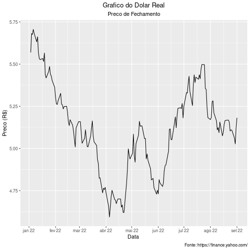

#### 7. Retorno, com base no Preco de Fechamento 

```r
  retorno_pf <- (preco_fechamento - shift(preco_fechamento, 1L, type="lag"))/shift(preco_fechamento, 1L, type="lag")
  retorno_pf <- na.omit(retorno_pf)
  tabela_preco_retorno <- cbind(preco_fechamento, retorno_pf)
  head(tabela_preco_retorno)
```

```
##            BRL.X.Close BRL.X.Close.1
## 2022-01-03    5.569300            NA
## 2022-01-04    5.681200  0.0200922917
## 2022-01-05    5.676200 -0.0008800958
## 2022-01-06    5.705635  0.0051856876
## 2022-01-07    5.682400 -0.0040722899
## 2022-01-10    5.632200 -0.0088342954
```

#### 8. Grafico de linha do Retorno 

```r
  ggplot(retorno_pf, aes(x = index(retorno_pf), y = 100*retorno_pf)) + geom_line() +
        labs(title="Grafico do Dolar Real", subtitle="Retorno", caption="Fonte: https://finance.yahoo.com/", x = "Data ", y="Retorno (%)") +
        theme(plot.title = element_text(hjust = 0.5), plot.subtitle = element_text(hjust = 0.5)) +
        scale_x_date(date_labels = "%b %y", date_breaks = "1 month")
```

```
## Don't know how to automatically pick scale for object of type xts/zoo. Defaulting to continuous.
```

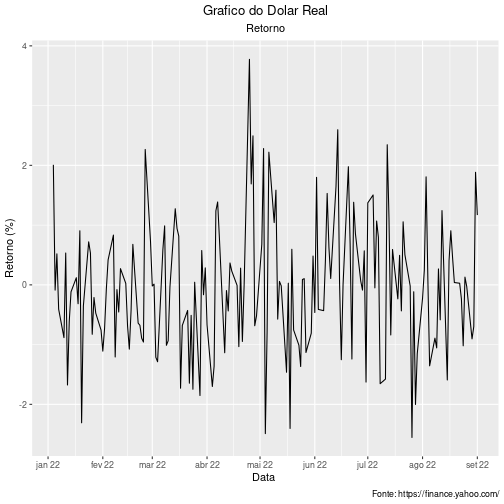

#### 9. Box plot para dados originais (Preco de Fechamento e Retorno) e padronizados 

```r
  boxplot_pf <- ggplot(data = preco_fechamento, aes(x = "", y = preco_fechamento))+
                      geom_violin(trim = FALSE, color="blue") +
                      geom_boxplot(width=0.4, color="blue", alpha = 1, outlier.size = 1) +
                      labs(x = "Preco", y = "") +
                      scale_y_continuous(breaks = seq(16, 23, by = 1))

  z_preco_fechamento <- (preco_fechamento - mean(preco_fechamento)) / sd(preco_fechamento)

  boxplot_z_pf <- ggplot(data = z_preco_fechamento, aes(x = "", y = z_preco_fechamento)) +
                        geom_violin(trim = FALSE, color="goldenrod3") +
                        geom_boxplot(width=0.4, color="red", alpha = 1, outlier.size = 1)+
                        labs(x = "Preco Padronizado", y = "") +
                        scale_y_continuous(breaks = seq(-5, 23, by = 1))

  boxplots_pf <- ggarrange(boxplot_pf, boxplot_z_pf,ncol = 2, nrow = 1)
  annotate_figure(boxplots_pf, top = text_grob("Boxplot/Vioplot do Preco de Fechamento\ne Preco de Fechamento Padronizado", color = "Black", face = "bold", size = 14),
                  bottom = text_grob("Fonte: https://finance.yahoo.com/", color = "black", hjust = 1.02, x = 1,size = 10))
```

 e padronizados USD-1.png)

```r
  boxplot_retorno <- ggplot(data = retorno_pf, aes(x = "", y = 100*retorno_pf)) +
                            geom_violin(trim = FALSE, color="blue") +
                            geom_boxplot(width=0.4, color="blue", alpha = 1, outlier.size = 1) +
                            labs(x = "Retorno (%)", y = "") +
                            scale_y_continuous(breaks = seq(-7, 6, by = 2))

  z_retorno_pf <- (retorno_pf - mean(retorno_pf))/(sd(retorno_pf))

  boxplot_z_retorno_pf <- ggplot(data = z_retorno_pf, aes(x = "", y = z_retorno_pf)) +
                            geom_violin(trim = FALSE, color="red") +
                            geom_boxplot(width=0.4, color="red", alpha = 1, outlier.size = 1) +
                            labs(x = "Retorno Padronizado", y = "") +
                            scale_y_continuous(breaks = seq(-3, 11, by = 2))

  boxplots_retorno <- ggarrange(boxplot_retorno, boxplot_z_retorno_pf,ncol = 2, nrow = 1)
  annotate_figure(boxplots_retorno, top = text_grob("Boxplot/Vioplot do Retorno\ne Retorno Padronizado",
                  color = "Black", face = "bold", size = 14),
                  bottom = text_grob("Fonte: https://finance.yahoo.com/",
                  color = "black", hjust = 1.02, x = 1, size = 10))
```

 e padronizados USD-2.png)


#### 10. Histograma para dados originais (Preco de Fechamento e Retorno) e padronizados 

```r
  histograma_pf <- ggplot(data = preco_fechamento,aes(x = preco_fechamento)) +
                          geom_histogram(color="blue", fill = "white", bins = 30) +
                          labs(y = "Quantidade", x = "Preco") +
                          scale_x_continuous(breaks = seq(17, 22, by = 0.5)) +
                          scale_y_continuous(breaks = seq(0, 30, by = 5)) +
                          theme(plot.title = element_text(hjust = 0.5))

  histograma_z_pf <- ggplot(data = z_preco_fechamento,aes(x = z_preco_fechamento)) +
                            geom_histogram(color="red", fill = "white", bins = 30) +
                            labs(y = "Quantidade", x = "Preco Padronizado") +
                            scale_x_continuous(breaks = seq(-2, 3.5, by = 0.5)) +
                            scale_y_continuous(breaks = seq(0, 50, by = 5)) +
                            theme(plot.title = element_text(hjust = 0.5))

  histogramas_pf <- ggarrange(histograma_pf, histograma_z_pf,ncol = 1, nrow = 2)
  annotate_figure(histogramas_pf, top = text_grob("Histograma do Preco de Fechamento",
                  color = "Black", face = "bold", size = 14),
                  bottom = text_grob("Fonte: https://finance.yahoo.com/",
                  color = "black", hjust = 1.02, x = 1, size = 10))
```

 e padronizados USD-1.png)

```r
  histograma_retorno <- ggplot(data = retorno_pf,aes(x = 100*retorno_pf)) + 
                                geom_histogram(color="blue", fill = "white", bins = 25) + 
                                labs(y = "Quantidade", x = "Retorno (%)") + 
                                scale_x_continuous(breaks = seq(-6, 6, by = 1)) + 
                                scale_y_continuous(breaks = seq(0, 40, by = 5)) + 
                                theme(plot.title = element_text(hjust = 0.5))

  histograma_z_retorno <- ggplot(data = z_retorno_pf ,aes(x = z_retorno_pf)) + 
                                geom_histogram(color="red", fill = "white", bins = 25) + 
                                labs(y = "Quantidade", x = "Retorno Padronizado") + 
                                scale_x_continuous(breaks = seq(-6, 6, by = 1)) + 
                                scale_y_continuous(breaks = seq(0, 35, by = 5)) + 
                                theme(plot.title = element_text(hjust = 0.5))

  histogramas_retorno <- ggarrange(histograma_retorno, histograma_z_retorno,ncol = 1, nrow = 2)
  annotate_figure(histogramas_retorno, top = text_grob("Histograma do Retorno",
                  color = "Black", face = "bold", size = 14),
                  bottom = text_grob("Fonte: https://finance.yahoo.com/",
                  color = "black", hjust = 1.02, x = 1, size = 10))
```

 e padronizados USD-2.png)

#### 11. QQPlot do retorno.  

```r
  qqplot_retorno <- ggplot(data = retorno_pf, aes(sample = 100*as.vector(retorno_pf))) +
                          stat_qq(size = 0.6) +labs(x = "Quantis Teoricos", y = "Quantis Amostrais",
                          title = "QQPlot do Retorno (%)") + theme(plot.title = element_text(hjust = 0.5)) +
                          scale_y_continuous(breaks = seq(-6, 4.5, by = 1.5))
```

#### 12. QQLine do retorno (fazer junto com o QQPlot).  

```r
  histograma_retorno_qqplot <- ggplot(data = retorno_pf,aes(x = 100*retorno_pf)) +
                                      geom_histogram(aes(y=..density..),color="blue", fill = "white", bins = 25) +
                                      stat_function(fun = dnorm, args = list(mean = mean(100*retorno_pf), sd = sd(100*retorno_pf)),
                                      col="red",lwd=1)+ theme(axis.text.x = element_blank(), axis.text.y = element_blank()) +
                                      labs(y = "", x = "") 

  qqplot_linha_retorno <- ggplot(data = retorno_pf, aes(sample = 100*as.vector(retorno_pf))) +
                                stat_qq(size = 0.6) + labs(x = "Quantis Teoricos", y = "Quantis Amostrais", title = "QQPlot do Retorno (%)") +
                                theme(plot.title = element_text(hjust = 0.5)) +scale_y_continuous(breaks = seq(-6, 4.5, by = 1.5)) +
                                stat_qq_line(col = 2,lwd=1,lty=1) 

  plot_principal <- qqplot_linha_retorno

  plot_para_inserir <- histograma_retorno_qqplot

  plot.com.insercao <- ggdraw() + draw_plot(plot_principal) + draw_plot(plot_para_inserir, x = 0.07, y = 0.6, width = .3, height = .3)
```

```
## Don't know how to automatically pick scale for object of type xts/zoo. Defaulting to continuous.
```

```r
  plot.com.insercao
```

. USD-1.png)

#### 13. Assimetria amostral nao viesada do retorno.   

```r
  n <- length(retorno_pf)
  somatorio <- c()
  for(i in 1:n){
    somatorio[i] <- ((retorno_pf[i] - mean(retorno_pf))/ sd(retorno_pf))^3
  }
  p1_s3 <- n/((n -1)*(n-2))
  p2_s3 <- sum(somatorio)
  s3 <- p1_s3*p2_s3
  s3
```

```
## [1] 0.3579442
```

#### 14. Curtose amostral nao viesada do retorno.   

```r
  n <- length(retorno_pf)
  somatorio <- c()
  for(i in 1:n){
    somatorio[i] <- ((retorno_pf[i] - mean(retorno_pf))/ sd(retorno_pf))^4
  }
  p1_s4 <- (n*(n +1))/((n -1)*(n-2)*(n-3))
  p2_s4 <- (sum(somatorio))
  p3_s4 <- (3*((n-1)^2))/((n-2)*(n-3))
  s4 <- p1_s4 * p2_s4 - p3_s4
  s4
```

```
## [1] 0.2961473
```


>### Dados BTC USD

```r
  dados.btc <- quantmod::getSymbols("BTC-USD", src = "yahoo", from = start, to = end, auto.assign = FALSE)
  dolar.bitcoin <- na.omit(dados.btc)
```


#### Cria o vetor de preco de fechamento

```r
  preco_fechamento <- dados.btc$"BTC-USD.Close"
```

#### 1. Media do Preco de Fechamento

```r
  media_pf <- mean(preco_fechamento)
  media_pf
```

```
## [1] 33014.49
```

#### 2. Moda do Preco de Fechamento

```r
  tab_preco_fechamento <- table(preco_fechamento)
  moda_pf <- names(tab_preco_fechamento)[which(tab_preco_fechamento==max(tab_preco_fechamento))]
  moda_pf
```

```
##   [1] "19017.642578" "19242.255859" "19269.367188" "19297.076172" "19323.914063"
##   [6] "19616.814453" "19784.726563" "19796.808594" "19970.556641" "19987.029297"
##  [11] "20041.738281" "20049.763672" "20104.023438" "20127.140625" "20190.115234"
##  [16] "20212.074219" "20231.261719" "20260.019531" "20280.634766" "20297.994141"
##  [21] "20381.650391" "20471.482422" "20548.246094" "20553.271484" "20569.919922"
##  [26] "20599.537109" "20710.597656" "20735.478516" "20779.34375"  "20836.328125"
##  [31] "20860.449219" "20877.552734" "21027.294922" "21085.876953" "21166.060547"
##  [36] "21190.316406" "21231.65625"  "21239.753906" "21361.701172" "21395.019531"
##  [41] "21398.908203" "21502.337891" "21528.087891" "21534.121094" "21592.207031"
##  [46] "21600.904297" "21637.587891" "21731.117188" "22206.792969" "22465.478516"
##  [51] "22485.689453" "22487.388672" "22572.839844" "22609.164063" "22630.957031"
##  [56] "22714.978516" "22846.507813" "22930.548828" "22961.279297" "22978.117188"
##  [61] "23164.318359" "23164.628906" "23175.890625" "23212.738281" "23231.732422"
##  [66] "23289.314453" "23314.199219" "23335.998047" "23336.896484" "23389.433594"
##  [71] "23656.207031" "23804.632813" "23809.486328" "23843.886719" "23883.291016"
##  [76] "23947.642578" "23957.529297" "24136.972656" "24319.333984" "24402.818359"
##  [81] "24424.068359" "26762.648438" "28360.810547" "28627.574219" "28720.271484"
##  [86] "28814.900391" "28936.355469" "29047.751953" "29083.804688" "29098.910156"
##  [91] "29200.740234" "29267.224609" "29283.103516" "29432.226563" "29445.957031"
##  [96] "29562.361328" "29655.585938" "29704.390625" "29799.080078" "29832.914063"
## [101] "29862.917969" "29906.662109" "30101.265625" "30111.998047" "30214.355469"
## [106] "30296.953125" "30314.333984" "30323.722656" "30425.857422" "30467.488281"
## [111] "31022.90625"  "31155.478516" "31305.113281" "31370.671875" "31726.390625"
## [116] "31792.310547" "34059.265625" "35030.25"     "35501.953125" "36040.921875"
## [121] "36276.804688" "36457.316406" "36575.140625" "36654.328125" "36852.121094"
## [126] "36952.984375" "36954.003906" "37075.28125"  "37138.234375" "37154.601563"
## [131] "37296.570313" "37709.785156" "37714.875"    "37750.453125" "37784.332031"
## [136] "37849.664063" "37917.601563" "38062.039063" "38117.460938" "38138.179688"
## [141] "38286.027344" "38332.609375" "38419.984375" "38431.378906" "38469.09375" 
## [146] "38483.125"    "38529.328125" "38609.824219" "38737.269531" "38743.273438"
## [151] "38794.972656" "38904.011719" "39105.148438" "39137.605469" "39214.21875" 
## [156] "39241.121094" "39338.785156" "39400.585938" "39437.460938" "39469.292969"
## [161] "39486.730469" "39521.902344" "39666.753906" "39698.371094" "39716.953125"
## [166] "39740.320313" "39773.828125" "39935.515625" "40030.976563" "40122.15625" 
## [171] "40127.183594" "40424.484375" "40458.308594" "40527.363281" "40538.011719"
## [176] "40553.464844" "40680.417969" "40826.214844" "40951.378906" "41077.996094"
## [181] "41143.929688" "41166.730469" "41247.824219" "41374.378906" "41441.164063"
## [186] "41500.875"    "41502.75"     "41557.902344" "41733.941406" "41744.328125"
## [191] "41801.15625"  "41821.261719" "41911.601563" "41982.925781" "42190.652344"
## [196] "42197.515625" "42207.671875" "42244.46875"  "42250.550781" "42287.664063"
## [201] "42358.808594" "42375.632813" "42407.9375"   "42412.433594" "42451.789063"
## [206] "42586.917969" "42591.570313" "42735.855469" "42782.136719" "42892.957031"
## [211] "43099.699219" "43113.878906" "43160.929688" "43177.398438" "43193.234375"
## [216] "43206.738281" "43503.847656" "43565.113281" "43569.003906" "43840.285156"
## [221] "43924.117188" "43949.101563" "43960.933594" "43961.859375" "44118.445313"
## [226] "44338.796875" "44348.730469" "44354.636719" "44500.828125" "44575.203125"
## [231] "45538.675781" "45555.992188" "45868.949219" "45897.574219" "46281.644531"
## [236] "46453.566406" "46458.117188" "46622.675781" "46820.492188" "47062.664063"
## [241] "47128.003906" "47345.21875"  "47465.730469" "47686.8125"
```

#### 3. Mediana do Preco de Fechamento

```r
  mediana_pf <- median(preco_fechamento)
  mediana_pf
```

```
## [1] 36516.23
```

#### 4. Variancia Nao Viesada

```r
  variancia_pf <- var(preco_fechamento)
  variancia_pf
```

```
##               BTC-USD.Close
## BTC-USD.Close      84190262
```

#### 5. Desvio-padrao

```r
  desv_pad_pf <- sd(preco_fechamento)
  desv_pad_pf
```

```
## [1] 9175.525
```

#### 6. Grafico de linha do Preco de Fechamento

```r
  ggplot(dados.btc, aes(x = index(dados.dj), y = preco_fechamento)) + geom_line() +
        labs(title="Grafico do BTC USD", subtitle="Preco de Fechamento", caption="Fonte: https://finance.yahoo.com/", x = "Data ", y="Preco (R$)") +
        theme(plot.title = element_text(hjust = 0.5), plot.subtitle = element_text(hjust = 0.5)) +
        scale_x_date(date_labels = "%b %y", date_breaks = "1 month")
```

```
## Don't know how to automatically pick scale for object of type xts/zoo. Defaulting to continuous.
```

```
## Error in `check_aesthetics()`:
## ! Aesthetics must be either length 1 or the same as the data (244): x
```

#### 7. Retorno, com base no Preco de Fechamento

```r
  retorno_pf <- (preco_fechamento - shift(preco_fechamento, 1L, type="lag"))/shift(preco_fechamento, 1L, type="lag")
  retorno_pf <- na.omit(retorno_pf)
  tabela_preco_retorno <- cbind(preco_fechamento, retorno_pf)
  head(tabela_preco_retorno)
```

```
##            BTC.USD.Close BTC.USD.Close.1
## 2022-01-01      47686.81              NA
## 2022-01-02      47345.22    -0.007163275
## 2022-01-03      46458.12    -0.018736877
## 2022-01-04      45897.57    -0.012065555
## 2022-01-05      43569.00    -0.050734061
## 2022-01-06      43160.93    -0.009366159
```

#### 8. Grafico de linha do Retorno

```r
  ggplot(retorno_pf, aes(x = index(retorno_pf), y = 100*retorno_pf)) + geom_line() +
        labs(title="Grafico do BTC USD", subtitle="Retorno", caption="Fonte: https://finance.yahoo.com/", x = "Data ", y="Retorno (%)") +
        theme(plot.title = element_text(hjust = 0.5), plot.subtitle = element_text(hjust = 0.5)) +
        scale_x_date(date_labels = "%b %y", date_breaks = "1 month")
```

```
## Don't know how to automatically pick scale for object of type xts/zoo. Defaulting to continuous.
```

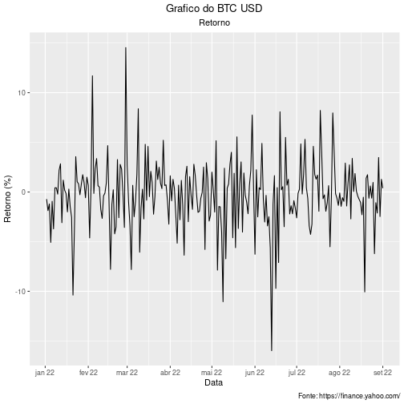

#### 9. Box plot para dados originais (Preco de Fechamento e Retorno) e padronizados

```r
  boxplot_pf <- ggplot(data = preco_fechamento, aes(x = "", y = preco_fechamento))+
                      geom_violin(trim = FALSE, color="blue") +
                      geom_boxplot(width=0.4, color="blue", alpha = 1, outlier.size = 1) +
                      labs(x = "Preco", y = "") +
                      scale_y_continuous(breaks = seq(16, 23, by = 1))

  z_preco_fechamento <- (preco_fechamento - mean(preco_fechamento)) / sd(preco_fechamento)

  boxplot_z_pf <- ggplot(data = z_preco_fechamento, aes(x = "", y = z_preco_fechamento)) +
                        geom_violin(trim = FALSE, color="goldenrod3") +
                        geom_boxplot(width=0.4, color="red", alpha = 1, outlier.size = 1)+
                        labs(x = "Preco Padronizado", y = "") +
                        scale_y_continuous(breaks = seq(-5, 23, by = 1))

  boxplots_pf <- ggarrange(boxplot_pf, boxplot_z_pf,ncol = 2, nrow = 1)
  annotate_figure(boxplots_pf, top = text_grob("Boxplot/Vioplot do Preco de Fechamento\ne Preco de Fechamento Padronizado", color = "Black", face = "bold", size = 14),
                  bottom = text_grob("Fonte: https://finance.yahoo.com/", color = "black", hjust = 1.02, x = 1,size = 10))
```

 e padronizados BTC-1.png)

```r
  boxplot_retorno <- ggplot(data = retorno_pf, aes(x = "", y = 100*retorno_pf)) +
                            geom_violin(trim = FALSE, color="blue") +
                            geom_boxplot(width=0.4, color="blue", alpha = 1, outlier.size = 1) +
                            labs(x = "Retorno (%)", y = "") +
                            scale_y_continuous(breaks = seq(-7, 6, by = 2))

  z_retorno_pf <- (retorno_pf - mean(retorno_pf))/(sd(retorno_pf))

  boxplot_z_retorno_pf <- ggplot(data = z_retorno_pf, aes(x = "", y = z_retorno_pf)) +
                            geom_violin(trim = FALSE, color="red") +
                            geom_boxplot(width=0.4, color="red", alpha = 1, outlier.size = 1) +
                            labs(x = "Retorno Padronizado", y = "") +
                            scale_y_continuous(breaks = seq(-3, 11, by = 2))

  boxplots_retorno <- ggarrange(boxplot_retorno, boxplot_z_retorno_pf,ncol = 2, nrow = 1)
  annotate_figure(boxplots_retorno, top = text_grob("Boxplot/Vioplot do Retorno\ne Retorno Padronizado",
                  color = "Black", face = "bold", size = 14),
                  bottom = text_grob("Fonte: https://finance.yahoo.com/",
                  color = "black", hjust = 1.02, x = 1, size = 10))
```

 e padronizados BTC-2.png)


#### 10. Histograma para dados originais (Preco de Fechamento e Retorno) e padronizados

```r
  histograma_pf <- ggplot(data = preco_fechamento,aes(x = preco_fechamento)) +
                          geom_histogram(color="blue", fill = "white", bins = 30) +
                          labs(y = "Quantidade", x = "Preco") +
                          scale_x_continuous(breaks = seq(17, 22, by = 0.5)) +
                          scale_y_continuous(breaks = seq(0, 30, by = 5)) +
                          theme(plot.title = element_text(hjust = 0.5))

  histograma_z_pf <- ggplot(data = z_preco_fechamento,aes(x = z_preco_fechamento)) +
                            geom_histogram(color="red", fill = "white", bins = 30) +
                            labs(y = "Quantidade", x = "Preco Padronizado") +
                            scale_x_continuous(breaks = seq(-2, 3.5, by = 0.5)) +
                            scale_y_continuous(breaks = seq(0, 50, by = 5)) +
                            theme(plot.title = element_text(hjust = 0.5))

  histogramas_pf <- ggarrange(histograma_pf, histograma_z_pf,ncol = 1, nrow = 2)
  annotate_figure(histogramas_pf, top = text_grob("Histograma do Preco de Fechamento",
                  color = "Black", face = "bold", size = 14),
                  bottom = text_grob("Fonte: https://finance.yahoo.com/",
                  color = "black", hjust = 1.02, x = 1, size = 10))
```

 e padronizados BTC-1.png)

```r
  histograma_retorno <- ggplot(data = retorno_pf,aes(x = 100*retorno_pf)) + 
                                geom_histogram(color="blue", fill = "white", bins = 25) + 
                                labs(y = "Quantidade", x = "Retorno (%)") + 
                                scale_x_continuous(breaks = seq(-6, 6, by = 1)) + 
                                scale_y_continuous(breaks = seq(0, 40, by = 5)) + 
                                theme(plot.title = element_text(hjust = 0.5))

  histograma_z_retorno <- ggplot(data = z_retorno_pf ,aes(x = z_retorno_pf)) + 
                                geom_histogram(color="red", fill = "white", bins = 25) + 
                                labs(y = "Quantidade", x = "Retorno Padronizado") + 
                                scale_x_continuous(breaks = seq(-6, 6, by = 1)) + 
                                scale_y_continuous(breaks = seq(0, 35, by = 5)) + 
                                theme(plot.title = element_text(hjust = 0.5))

  histogramas_retorno <- ggarrange(histograma_retorno, histograma_z_retorno,ncol = 1, nrow = 2)
  annotate_figure(histogramas_retorno, top = text_grob("Histograma do Retorno",
                  color = "Black", face = "bold", size = 14),
                  bottom = text_grob("Fonte: https://finance.yahoo.com/",
                  color = "black", hjust = 1.02, x = 1, size = 10))
```

 e padronizados BTC-2.png)

#### 11. QQPlot do retorno. 

```r
  qqplot_retorno <- ggplot(data = retorno_pf, aes(sample = 100*as.vector(retorno_pf))) +
                          stat_qq(size = 0.6) +labs(x = "Quantis Teoricos", y = "Quantis Amostrais",
                          title = "QQPlot do Retorno (%)") + theme(plot.title = element_text(hjust = 0.5)) +
                          scale_y_continuous(breaks = seq(-6, 4.5, by = 1.5))
```

#### 12. QQLine do retorno (fazer junto com o QQPlot). 

```r
  histograma_retorno_qqplot <- ggplot(data = retorno_pf,aes(x = 100*retorno_pf)) +
                                      geom_histogram(aes(y=..density..),color="blue", fill = "white", bins = 25) +
                                      stat_function(fun = dnorm, args = list(mean = mean(100*retorno_pf), sd = sd(100*retorno_pf)),
                                      col="red",lwd=1)+ theme(axis.text.x = element_blank(), axis.text.y = element_blank()) +
                                      labs(y = "", x = "") 

  qqplot_linha_retorno <- ggplot(data = retorno_pf, aes(sample = 100*as.vector(retorno_pf))) +
                                stat_qq(size = 0.6) + labs(x = "Quantis Teoricos", y = "Quantis Amostrais", title = "QQPlot do Retorno (%)") +
                                theme(plot.title = element_text(hjust = 0.5)) +scale_y_continuous(breaks = seq(-6, 4.5, by = 1.5)) +
                                stat_qq_line(col = 2,lwd=1,lty=1) 

  plot_principal <- qqplot_linha_retorno

  plot_para_inserir <- histograma_retorno_qqplot

  plot.com.insercao <- ggdraw() + draw_plot(plot_principal) + draw_plot(plot_para_inserir, x = 0.07, y = 0.6, width = .3, height = .3)
```

```
## Don't know how to automatically pick scale for object of type xts/zoo. Defaulting to continuous.
```

```r
  plot.com.insercao
```

. BTC-1.png)

#### 13. Assimetria amostral nao viesada do retorno.  

```r
  n <- length(retorno_pf)
  somatorio <- c()
  for(i in 1:n){
    somatorio[i] <- ((retorno_pf[i] - mean(retorno_pf))/ sd(retorno_pf))^3
  }
  p1_s3 <- n/((n -1)*(n-2))
  p2_s3 <- sum(somatorio)
  s3 <- p1_s3*p2_s3
  s3
```

```
## [1] -0.1659159
```

#### 14. Curtose amostral nao viesada do retorno.  

```r
  n <- length(retorno_pf)
  somatorio <- c()
  for(i in 1:n){
    somatorio[i] <- ((retorno_pf[i] - mean(retorno_pf))/ sd(retorno_pf))^4
  }
  p1_s4 <- (n*(n +1))/((n -1)*(n-2)*(n-3))
  p2_s4 <- (sum(somatorio))
  p3_s4 <- (3*((n-1)^2))/((n-2)*(n-3))
  s4 <- p1_s4 * p2_s4 - p3_s4
  s4
```

```
## [1] 3.312553
```

# Questao 2
>Sabe-se da combinatória que 
$$
  {n \choose i} = \frac{n!}{(n-i)!*i!}
$$

### Caso 6+2:
>Dado que deve-se escolher 6 numero de 50 da matriz de numeros e escolher 2 de 6
>da matriz de trevos, temos, entao um problema de combinaçao, em que o numero  total
>de combinacoes possiveis é dado por (50 6)x(6 2) = 238.360.500.

>Ademais, a probabilidade associada deve ser: 
$$
\frac{1}{238.360.500} = 4,2*10^{-9}
$$

### Caso 6+1 e 6+0:
>Nesse caso temos a soma de dois possiveis cenarios, isto é, quando nos trevos (1) 
>somente um dos pares escolhidos é o certo e quando nos trevos (2) nenhum dos pares
>escolhidos é o certo. Assim, temos para:
>- (1): deve-se escolher 1 dos 4 trevos nao sorteados e 1 dos 2 trevos sorteados
>- (2): deve-se escolher 2 dos 4 trevos nao sorteados
>Por fim, temos: 238.360.500/[(4 1)x(2 1) + (4 2)] = 17.025.750

>Ademais, a probabilidade associada deve ser: 
$$
\frac{1}{17.025.750} = 5,9*10^{-8}
$$

### Caso 5+2:
> Aqui é escolhido 1 dos 44 numeros nao sorteados para ser errado e 5 dos 6 sorteados
> para ser o acerto, assim: 238.360.500/[(44 1)x(6 5)] = 902.881

>Ademais, a probabilidade associada deve ser: 
$$
\frac{1}{902.881} = 1,1*10^{-6}
$$

### Caso 5+1 e 5+0:
>- (1): deve-se escolher 1 dos 4 trevos nao sorteados, 1 dos 2 trevos sorteados, 1 dos
>44 numeros nao sorteados para ser errado e 5 dos 6 sorteados para ser o acerto.
>- (2): deve-se escolher 2 dos 4 trevos nao sorteados, 1 dos 44 numeros nao sorteados
>para ser errado e 5 dos 6 sorteados para ser o acerto. 
>Temos: 238.360.500/[(4 1)x(2 1)x(44 1)x(6 5) + (4 2)x(44 1)x(6 5)] = 64.491

>Ademais, a probabilidade associada deve ser: 
$$
\frac{1}{64.491} = 1,5*10^{-5}
$$

### Caso 4+2:
> Com raciocinio similar ao Caso 5+2, temos: 238.360.500/[(44 2)x(6 4)] = 16.798

>Ademais, a probabilidade associada deve ser: 
$$
\frac{1}{16.798} = 6,0*10^{-5}
$$

### Caso 4+1 e 4+0:
> Com raciocinio similar ao Caso 5+1 e 5+0, temos: 
> 238.360.500/[(4 1)x(2 1)x(44 2)x(6 4) + (4 2)x(44 2)x(6 4)] = 1200

>Ademais, a probabilidade associada deve ser: 
$$
\frac{1}{1200} = 8,3*10^{-4}
$$

### Caso 3+2:
> Com raciocinio similar ao Caso 5+2, temos: 238.360.500/[(44 3)x(6 3)] = 900

>Ademais, a probabilidade associada deve ser: 
$$
\frac{1}{900} = 1,1*10^{-3}
$$

### Caso 3+1:
> Com raciocinio similar ao Caso 5+1 e 5+0, temos: 
> 238.360.500/[(4 1)x(2 1)x(44 3)x(6 3)] = 112

>Ademais, a probabilidade associada deve ser: 
$$
\frac{1}{112} = 8,9*10^{-3}
$$

### Caso 2+2:
> Com raciocinio similar ao Caso 5+2, temos: 238.360.500/[(44 4)x(6 2)] = 117

>Ademais, a probabilidade associada deve ser: 
$$
\frac{1}{117} = 8,5*10^{-3}
$$

### Caso 2+1:
> Com raciocinio similar ao Caso 3+1, temos: 
> 238.360.500/[(4 1)x(2 1)x(44 4)x(6 2)] = 15

>Ademais, a probabilidade associada deve ser: 
$$
\frac{1}{15} = 6,7*10^{-2}
$$

# Questão 3
a. A probabilidade P(CF+ | NEG) para Caucasianos Não Hispânicos. Esse resultado
representa aproximadamente quantos indivíduos por milhão de habitantes ?
$$
P(CF_+|NEG) = \frac{0,040 * 0,01}{0,040 * 0,01 + 0,960 * 0,998} = 0,000417327
$$
Representa aproximadamente **417** habitantes por milhão

b. A probabilidade P(CF+ | NEG) para Hispano-americanos. Esse resultado representa
aproximadamente quantos indivíduos por milhão de habitantes ?
$$
P(CF_+|NEG) = \frac{0,017 * 0,01}{0,017 * 0,01 + 0,983 * 0,998} = 0,000173257
$$
Representa aproximadamente **173** habitantes por milhão

c. A probabilidade P(CF+ | NEG) para Afro-americanos. Esse resultado representa
aproximadamente quantos indivíduos por milhão de habitantes ?
$$
P(CF_+|NEG) = \frac{0,016 * 0,01}{0,016 * 0,01 + 0,984 * 0,998} = 0,000162901
$$
Representa aproximadamente **163** habitantes por milhão

d. A probabilidade P(CF+ | NEG) para Judeus Asquenazes. Esse resultado representa
aproximadamente quantos indivíduos por milhão de habitantes ?
$$
P(CF_+|NEG) = \frac{0,042 * 0,01}{0,042 * 0,01 + 0,958 * 0,998} = 0,000439099
$$
Representa aproximadamente **439** habitantes por milhão

e. A probabilidade P(CF+ | NEG) para Asiático-americanos. Esse resultado representa
aproximadamente quantos indivíduos por milhão de habitantes ?
$$
P(CF_+|NEG) = \frac{0,011 * 0,01}{0,011 * 0,01 + 0,989 * 0,998} = 0,000111434
$$
Representa aproximadamente **111** habitantes por milhão

# Questão 4
**4.1**

a. Verifique que f(x) é uma função de densidade de probabilidade.
$$
\ \int_{1}^{\infty} \frac{3}{x^4} \,dx \ = 3 * (0 - \frac{1}{-3 * 1^3}) = 1
$$

b. Calcule $$P(3,4 \leq X < 7,1)$$
Com isso, temos que:
$$
\ \int_{3,4}^{7,1} \frac{3}{x^4} \,dx \ = 3 * (\frac{1}{-3 * 7,1^3} - \frac{1}{-3 * 3,4^3}) = 0,0226
$$

c. Determine o valor esperado de X
$$
\ \int_{3,4}^{7,1} x * \frac{3}{x^4} \,dx \ = 3 * (\frac{1}{-2 * 7,1^2} - \frac{1}{-2 * 3,4^2}) = 0,1000
$$

d. Determine a variância de X
$$
\ \int_{3,4}^{7,1} (x - 0,1)^2 * \frac{3}{x^4} \,dx \ = 0,4400
$$

**4.2**

Como temos variáveis aletórias indenpendentes, podemos considerar:
$$
E[X] = \frac{8}{E[Y^2]}
$$
$$
\frac{24}{E[X^2]} = E[Y^2]
$$
$$
E[X^2] = \frac{6}{E[Y]}
$$
$$
2 = E[Y] 
$$
Portanto, E[X] = 1

**4.3**

$$
\ \int_{0}^{1} x * \frac{1}{\pi(1+x^2)} \,dx \ = 0,1103
$$


```r
  library("knitr")
  knit("p1.rmd", output = "p1.md")
```

```
## 
## 
## processing file: p1.rmd
```

```
## 
  |                                                                                     
  |                                                                               |   0%
  |                                                                                     
  |.............                                                                  |  17%
## label: unnamed-chunk-63 (with options) 
## List of 1
##  $ child: chr "./q1/q1.rmd"
```

```
## 
## 
## processing file: ././q1/q1.rmd
```

```
## 
  |                                                                                     
  |                                                                               |   0%
  |                                                                                     
  |...........                                                                    |  14%
## label: unnamed-chunk-68 (with options) 
## List of 1
##  $ child: chr "q1_sp500.rmd"
```

```
## 
## 
## processing file: ././q1/q1_sp500.rmd
```

```
## Quitting from lines 2-3 (././q1/q1_sp500.rmd)
```

```
## Quitting from lines 2-3 (././q1/q1_sp500.rmd)
```

```
## Error in parse_block(g[-1], g[1], params.src, markdown_mode): Duplicate chunk label 'Grafico de linha do Preco de Fechamento', which has been used for the chunk:
##   ggplot(dados.sp500, aes(x = index(dados.sp500), y = preco_fechamento)) + geom_line() +
##         labs(title="Grafico do SP 500", subtitle="Preco de Fechamento", caption="Fonte: https://finance.yahoo.com/", x = "Data ", y="Preco (R$)") +
##         theme(plot.title = element_text(hjust = 0.5), plot.subtitle = element_text(hjust = 0.5)) +
##         scale_x_date(date_labels = "%b %y", date_breaks = "1 month")
```
